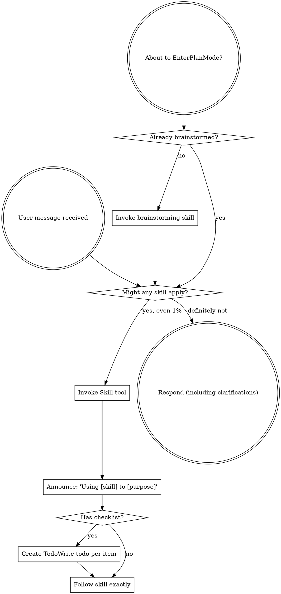

# 01 using-superpowers

## 速查卡 (Quick Reference)

| 维度           | 内容 |
|----------------|------|
| 触发时机       | 任意对话开始时——在做出任何响应（包括澄清性提问）之前必须调用 |
| 调用链上游     | 无（这是所有对话的入口 skill） |
| 调用链下游     | brainstorming、writing-plans、executing-plans、systematic-debugging、test-driven-development、using-git-worktrees、finishing-a-development-branch、requesting-code-review、receiving-code-review、subagent-driven-development、dispatching-parallel-agents、verification-before-completion、writing-skills 等全部 13 个其他 skills |
| 核心产出       | 建立 Claude 使用 skills 的行为规范——确保每次响应前先检查并调用相关 skill |
| 关联 Subagents | 无 |

---

## 一、原文

### SKILL.md

```
---
name: using-superpowers
description: Use when starting any conversation - establishes how to find and use skills, requiring Skill tool invocation before ANY response including clarifying questions
---

<SUBAGENT-STOP>
If you were dispatched as a subagent to execute a specific task, skip this skill.
</SUBAGENT-STOP>

<EXTREMELY-IMPORTANT>
If you think there is even a 1% chance a skill might apply to what you are doing, you ABSOLUTELY MUST invoke the skill.

IF A SKILL APPLIES TO YOUR TASK, YOU DO NOT HAVE A CHOICE. YOU MUST USE IT.

This is not negotiable. This is not optional. You cannot rationalize your way out of this.
</EXTREMELY-IMPORTANT>

## Instruction Priority

Superpowers skills override default system prompt behavior, but **user instructions always take precedence**:

1. **User's explicit instructions** (CLAUDE.md, GEMINI.md, AGENTS.md, direct requests) — highest priority
2. **Superpowers skills** — override default system behavior where they conflict
3. **Default system prompt** — lowest priority

If CLAUDE.md, GEMINI.md, or AGENTS.md says "don't use TDD" and a skill says "always use TDD," follow the user's instructions. The user is in control.

## How to Access Skills

**In Claude Code:** Use the `Skill` tool. When you invoke a skill, its content is loaded and presented to you—follow it directly. Never use the Read tool on skill files.

**In Gemini CLI:** Skills activate via the `activate_skill` tool. Gemini loads skill metadata at session start and activates the full content on demand.

**In other environments:** Check your platform's documentation for how skills are loaded.

## Platform Adaptation

Skills use Claude Code tool names. Non-CC platforms: see `references/codex-tools.md` (Codex) for tool equivalents. Gemini CLI users get the tool mapping loaded automatically via GEMINI.md.

# Using Skills

## The Rule

**Invoke relevant or requested skills BEFORE any response or action.** Even a 1% chance a skill might apply means that you should invoke the skill to check. If an invoked skill turns out to be wrong for the situation, you don't need to use it.



## Red Flags

These thoughts mean STOP—you're rationalizing:

| Thought | Reality |
|---------|---------|
| "This is just a simple question" | Questions are tasks. Check for skills. |
| "I need more context first" | Skill check comes BEFORE clarifying questions. |
| "Let me explore the codebase first" | Skills tell you HOW to explore. Check first. |
| "I can check git/files quickly" | Files lack conversation context. Check for skills. |
| "Let me gather information first" | Skills tell you HOW to gather information. |
| "This doesn't need a formal skill" | If a skill exists, use it. |
| "I remember this skill" | Skills evolve. Read current version. |
| "This doesn't count as a task" | Action = task. Check for skills. |
| "The skill is overkill" | Simple things become complex. Use it. |
| "I'll just do this one thing first" | Check BEFORE doing anything. |
| "This feels productive" | Undisciplined action wastes time. Skills prevent this. |
| "I know what that means" | Knowing the concept ≠ using the skill. Invoke it. |

## Skill Priority

When multiple skills could apply, use this order:

1. **Process skills first** (brainstorming, debugging) - these determine HOW to approach the task
2. **Implementation skills second** (frontend-design, mcp-builder) - these guide execution

"Let's build X" → brainstorming first, then implementation skills.
"Fix this bug" → debugging first, then domain-specific skills.

## Skill Types

**Rigid** (TDD, debugging): Follow exactly. Don't adapt away discipline.

**Flexible** (patterns): Adapt principles to context.

The skill itself tells you which.

## User Instructions

Instructions say WHAT, not HOW. "Add X" or "Fix Y" doesn't mean skip workflows.
```

### references/codex-tools.md

```
# Codex Tool Mapping

Skills use Claude Code tool names. When you encounter these in a skill, use your platform equivalent:

| Skill references | Codex equivalent |
|-----------------|------------------|
| `Task` tool (dispatch subagent) | `spawn_agent` |
| Multiple `Task` calls (parallel) | Multiple `spawn_agent` calls |
| Task returns result | `wait` |
| Task completes automatically | `close_agent` to free slot |
| `TodoWrite` (task tracking) | `update_plan` |
| `Skill` tool (invoke a skill) | Skills load natively — just follow the instructions |
| `Read`, `Write`, `Edit` (files) | Use your native file tools |
| `Bash` (run commands) | Use your native shell tools |

## Subagent dispatch requires multi-agent support

Add to your Codex config (`~/.codex/config.toml`):

```toml
[features]
multi_agent = true
```

This enables `spawn_agent`, `wait`, and `close_agent` for skills like `dispatching-parallel-agents` and `subagent-driven-development`.
```

### references/gemini-tools.md

```
# Gemini CLI Tool Mapping

Skills use Claude Code tool names. When you encounter these in a skill, use your platform equivalent:

| Skill references | Gemini CLI equivalent |
|-----------------|----------------------|
| `Read` (file reading) | `read_file` |
| `Write` (file creation) | `write_file` |
| `Edit` (file editing) | `replace` |
| `Bash` (run commands) | `run_shell_command` |
| `Grep` (search file content) | `grep_search` |
| `Glob` (search files by name) | `glob` |
| `TodoWrite` (task tracking) | `write_todos` |
| `Skill` tool (invoke a skill) | `activate_skill` |
| `WebSearch` | `google_web_search` |
| `WebFetch` | `web_fetch` |
| `Task` tool (dispatch subagent) | No equivalent — Gemini CLI does not support subagents |

## No subagent support

Gemini CLI has no equivalent to Claude Code's `Task` tool. Skills that rely on subagent dispatch (`subagent-driven-development`, `dispatching-parallel-agents`) will fall back to single-session execution via `executing-plans`.

## Additional Gemini CLI tools

These tools are available in Gemini CLI but have no Claude Code equivalent:

| Tool | Purpose |
|------|---------|
| `list_directory` | List files and subdirectories |
| `save_memory` | Persist facts to GEMINI.md across sessions |
| `ask_user` | Request structured input from the user |
| `tracker_create_task` | Rich task management (create, update, list, visualize) |
| `enter_plan_mode` / `exit_plan_mode` | Switch to read-only research mode before making changes |
```

---

## 二、中文翻译

### SKILL.md 翻译

**frontmatter**

```
name: using-superpowers
description: 在任意对话开始时使用——建立发现和使用 skills 的规范，
要求在做出任何响应（包括澄清性提问）之前必须调用 Skill 工具
```

**SUBAGENT-STOP**

如果你是作为 subagent 被派遣来执行特定任务的，跳过此 skill。

**EXTREMELY-IMPORTANT**

如果你认为某个 skill 有哪怕 1% 的可能适用于你正在做的事情，你绝对必须调用该 skill。

如果一个 skill 适用于你的任务，你没有选择。你必须使用它。

这不可谈判。这不是可选的。你无法用理由绕过这一点。

**指令优先级**

Superpowers skills 会覆盖默认 system prompt 的行为，但**用户指令始终优先**：

1. **用户的明确指令**（CLAUDE.md、GEMINI.md、AGENTS.md、直接请求）——最高优先级
2. **Superpowers skills**——在冲突处覆盖默认系统行为
3. **默认 system prompt**——最低优先级

如果 CLAUDE.md 说"不要用 TDD"而某个 skill 说"始终用 TDD"，遵从用户指令。用户拥有控制权。

**如何访问 Skills**

**在 Claude Code 中：** 使用 `Skill` 工具。调用 skill 后，其内容会被加载并呈现给你——直接按照它执行。永远不要用 Read 工具读取 skill 文件。

**在 Gemini CLI 中：** Skills 通过 `activate_skill` 工具激活。Gemini 在会话开始时加载 skill 元数据，按需激活完整内容。

**在其他环境中：** 查看你所在平台的文档了解 skills 如何加载。

**平台适配**

Skills 使用 Claude Code 的工具名称。非 CC 平台：Codex 用户参见 `references/codex-tools.md` 获取工具对照。Gemini CLI 用户通过 GEMINI.md 自动获得工具映射。

**使用 Skills**

**规则**

**在任何响应或行动之前，先调用相关或被请求的 skill。** 哪怕只有 1% 的可能某个 skill 适用，你也应该调用它来检查。如果调用后发现该 skill 不适合当前情况，无需继续使用它。

*（原文此处为 Graphviz dot 格式流程图，ASCII 重绘版本见 3.4 节）*

**警示信号（Red Flags）**

以下想法意味着立刻停止——你正在为自己找借口：

| 想法 | 现实 |
|------|------|
| "这只是个简单问题" | 问题也是任务。检查 skills。 |
| "我先需要更多上下文" | skill 检查在澄清性提问之前。 |
| "让我先探索一下代码库" | Skills 告诉你怎样探索。先检查。 |
| "我可以快速查一下 git/文件" | 文件缺乏对话上下文。检查 skills。 |
| "让我先收集一下信息" | Skills 告诉你如何收集信息。 |
| "这不需要正式的 skill" | 如果 skill 存在，就用它。 |
| "我记得这个 skill" | Skills 会演进。读取当前版本。 |
| "这算不上任务" | 行动 = 任务。检查 skills。 |
| "这个 skill 太繁琐了" | 简单的事会变复杂。用它。 |
| "我先做完这一件事" | 在做任何事之前先检查。 |
| "这样感觉很有效率" | 无纪律的行动浪费时间。Skills 防止这一点。 |
| "我知道那是什么意思" | 了解概念 ≠ 使用 skill。调用它。 |

**Skill 优先级**

当多个 skills 可能适用时，按以下顺序：

1. **过程类 skills 优先**（brainstorming、debugging）——决定如何处理任务
2. **实现类 skills 其次**（frontend-design、mcp-builder）——指导执行

"我们来构建 X" → 先 brainstorming，再实现类 skills。
"修复这个 bug" → 先 debugging，再领域专属 skills。

**Skill 类型**

**刚性**（TDD、debugging）：严格遵循。不要因为适应上下文而放弃纪律。

**灵活性**（patterns）：将原则适配到上下文。

skill 本身会告诉你它属于哪种类型。

**用户指令**

用户指令说的是做什么（WHAT），不是怎么做（HOW）。"添加 X"或"修复 Y"并不意味着跳过工作流。

---

### references/codex-tools.md 翻译

**Codex 工具映射**

Skills 使用 Claude Code 的工具名称。在 Codex 环境中遇到这些工具名时，使用平台对应的等效工具：

| Skill 中引用的工具 | Codex 等效工具 |
|-------------------|---------------|
| `Task` 工具（派遣 subagent） | `spawn_agent` |
| 多个 `Task` 并行调用 | 多个 `spawn_agent` 调用 |
| Task 返回结果 | `wait` |
| Task 自动完成 | `close_agent` 释放槽位 |
| `TodoWrite`（任务追踪） | `update_plan` |
| `Skill` 工具（调用 skill） | Skills 原生加载——直接按照指令执行即可 |
| `Read`、`Write`、`Edit`（文件操作） | 使用你的原生文件工具 |
| `Bash`（运行命令） | 使用你的原生 shell 工具 |

**Subagent 派遣需要多智能体支持**

在 Codex 配置文件（`~/.codex/config.toml`）中添加：

```toml
[features]
multi_agent = true
```

这将启用 `spawn_agent`、`wait` 和 `close_agent`，用于 `dispatching-parallel-agents` 和 `subagent-driven-development` 等 skills。

---

### references/gemini-tools.md 翻译

**Gemini CLI 工具映射**

Skills 使用 Claude Code 的工具名称。在 Gemini CLI 环境中遇到这些工具名时，使用平台对应的等效工具：

| Skill 中引用的工具 | Gemini CLI 等效工具 |
|-------------------|---------------------|
| `Read`（读取文件） | `read_file` |
| `Write`（创建文件） | `write_file` |
| `Edit`（编辑文件） | `replace` |
| `Bash`（运行命令） | `run_shell_command` |
| `Grep`（搜索文件内容） | `grep_search` |
| `Glob`（按名称搜索文件） | `glob` |
| `TodoWrite`（任务追踪） | `write_todos` |
| `Skill` 工具（调用 skill） | `activate_skill` |
| `WebSearch` | `google_web_search` |
| `WebFetch` | `web_fetch` |
| `Task` 工具（派遣 subagent） | 无等效工具——Gemini CLI 不支持 subagents |

**无 subagent 支持**

Gemini CLI 没有与 Claude Code `Task` 工具等效的工具。依赖 subagent 派遣的 skills（`subagent-driven-development`、`dispatching-parallel-agents`）将回退到通过 `executing-plans` 在单会话中执行。

**Gemini CLI 专有工具**

以下工具在 Gemini CLI 中可用，但在 Claude Code 中没有对应工具：

| 工具 | 用途 |
|------|------|
| `list_directory` | 列出文件和子目录 |
| `save_memory` | 跨会话持久化事实到 GEMINI.md |
| `ask_user` | 向用户请求结构化输入 |
| `tracker_create_task` | 丰富的任务管理（创建、更新、列表、可视化） |
| `enter_plan_mode` / `exit_plan_mode` | 在做出更改前切换到只读研究模式 |

---

## 三、剖析解读

### 3.1 功能与定位

`using-superpowers` 是整个 Superpowers 系统的**元 skill / 入口 skill**。它不完成任何具体业务任务，而是建立一套 Claude 使用所有其他 skills 的行为规范。

**核心职责：**

1. **强制性时序约束**：确保 Claude 在做出任何响应之前先检查并调用相关 skill，打破"直接回答"的默认冲动
2. **优先级仲裁**：明确用户指令 > Skills > 默认 system prompt 的三层优先级
3. **跨平台适配入口**：通过 references 文件解决同一套 skills 在 Claude Code / Codex / Gemini CLI 三个平台上工具名称不同的问题
4. **认知防御**：通过"Red Flags"表格，列出 Claude 常见的自我合理化借口，强制打断这些思维模式

**关键设计哲学：** 这个 skill 的核心是解决 AI 的"惯性问题"——LLM 倾向于直接给出答案，而不是先查阅规范。`using-superpowers` 通过极强的强制性语言（"1% chance"、"NOT NEGOTIABLE"）和详细的反模式列表，在行为层面建立纪律。

### 3.2 使用场景与案例

**标准触发场景：** 每一个新对话的开始。

**具体案例对比：**

**错误行为（未遵循 using-superpowers）：**
```
用户: "帮我添加一个登录功能"
Claude: "好的，我来帮你实现登录功能。首先我们需要创建一个
        LoginForm 组件，然后..."
        [直接开始写代码]
```

**正确行为（遵循 using-superpowers）：**
```
用户: "帮我添加一个登录功能"
Claude: [调用 Skill("using-superpowers")]
        [识别到这是功能开发任务]
        [调用 Skill("brainstorming")]
        "Using brainstorming to explore the login feature design..."
        [按 brainstorming skill 的流程执行]
```

**更微妙的错误场景——"先问个问题"：**
```
用户: "修复这个 bug"
错误: "你能描述一下 bug 的表现吗？" [先澄清，后检查 skills]
正确: [先调用 Skill("using-superpowers")]
      [调用 Skill("systematic-debugging")]
      [按 debugging skill 的流程收集上下文]
```

**关键洞察：** 即使是澄清性问题，也必须在 skill 检查之后发出——因为 skill 本身会告诉你如何收集信息，顺序不能颠倒。

### 3.3 Subagents / References 深度解读

此 skill 本身没有 subagent，但包含两个关键 reference 文件，解决的是同一个问题：**工具名称的跨平台差异**。

**设计背景：**

Superpowers skills 是以 Claude Code 为基准编写的，所有工具引用（`Read`、`Write`、`Bash`、`Task`、`Skill` 等）都是 Claude Code 的工具 API。当同一套 skills 被部署到其他 AI 平台时，工具名称不同，需要一个映射表。

**`codex-tools.md` 解读：**

Codex（OpenAI 的 CLI）与 Claude Code 最大的差异在 subagent 层：

```
Claude Code          Codex
-----------          -----
Task (spawn)    -->  spawn_agent
Task (result)   -->  wait
Task (cleanup)  -->  close_agent
TodoWrite       -->  update_plan
```

关键细节：Codex 的多智能体功能默认未开启，需要在 `config.toml` 中手动启用 `multi_agent = true`，否则依赖 subagent 的 skills 将无法正常工作。

**`gemini-tools.md` 解读：**

Gemini CLI 有两个重要特征：

1. **缺失 subagent 支持**：`Task` 工具在 Gemini CLI 中完全没有等效工具。这意味着 `subagent-driven-development` 和 `dispatching-parallel-agents` 两个 skills 在 Gemini CLI 上只能降级为串行执行（通过 `executing-plans`）。

2. **额外的专有工具**：Gemini CLI 提供了一些 Claude Code 没有的工具，例如 `save_memory`（跨会话记忆）、`ask_user`（结构化用户输入）、`enter_plan_mode`（只读研究模式）。这些工具在 skills 中不会被引用，但 Gemini 用户可以在执行 skills 时额外利用。

**平台能力对比：**

```
Feature              Claude Code    Codex         Gemini CLI
-------------------  -----------    -----         ----------
Subagent dispatch    Yes (Task)     Yes*          No
Skill invocation     Skill tool     Native load   activate_skill
Cross-session mem    CLAUDE.md      config.toml   save_memory
Plan mode            TodoWrite      update_plan   enter_plan_mode

* requires config.toml: multi_agent = true
```

### 3.4 流程图 / 示意图

**宏观：会话级决策流程**

```
Session Start (用户发出第一条消息)
            |
            v
  +-----------------------+
  | Check: any skill      |
  | might apply? (>=1%)   |
  +-----------------------+
       |           |
      yes          no (definitely not)
       |           |
       v           v
  Invoke         Respond
  Skill tool     directly
       |
       v
  Announce: "Using [skill] to [purpose]"
       |
       v
  Has checklist in skill?
       |              |
      yes             no
       |              |
       v              v
  Create TodoWrite   Follow skill
  per item           exactly
       |              |
       +------+-------+
              |
              v
         Follow skill
         (may invoke
          downstream
          skills)
              |
              v
         Task complete
```

**特殊路径：进入 Plan Mode 前**

```
About to EnterPlanMode?
        |
        v
Already brainstormed?
    |           |
   no           yes
    |           |
    v           v
Invoke      Check other
brainstorming  skills
skill
    |
    v
Continue normal skill flow
```

**using-superpowers 在整体 skills 生态中的位置**

```
                  using-superpowers
                  (ALL conversations)
                         |
          +--------------+--------------+
          |              |              |
    [Explore/Plan]  [Execute/Build]  [QA/Review]
          |              |              |
    brainstorming   executing-plans  systematic-debugging
    writing-plans   test-driven-dev  verification-before-completion
                    using-git-       requesting-code-review
                    worktrees        receiving-code-review
                    dispatching-
                    parallel-agents
                    subagent-driven-
                    development
                    finishing-a-
                    development-branch
                    writing-skills
```

### 3.5 与其他 Skills 的协作关系

| 协作 Skill | 关系类型 | 说明 |
|------------|----------|------|
| brainstorming | 下游（最常见首选） | 新功能/新任务通常在 using-superpowers 之后立即调用 brainstorming |
| writing-plans | 下游 | brainstorming 之后，进入计划制定阶段 |
| executing-plans | 下游 | 有计划后执行实现 |
| systematic-debugging | 下游 | bug 修复类任务的首选 skill |
| test-driven-development | 下游 | 开发阶段，若项目要求 TDD |
| using-git-worktrees | 下游 | 需要隔离环境时 |
| finishing-a-development-branch | 下游 | 开发完成，准备合并时 |
| requesting-code-review | 下游 | 提交前发起 review |
| receiving-code-review | 下游 | 处理收到的 review 意见 |
| subagent-driven-development | 下游 | 大型任务并行化开发 |
| dispatching-parallel-agents | 下游 | 多 subagent 并行执行 |
| verification-before-completion | 下游 | 任务完成前的最终验证 |
| writing-skills | 下游 | 编写或改进 skills 本身时 |

> 此 skill 为系统入口，无上游调用方。
