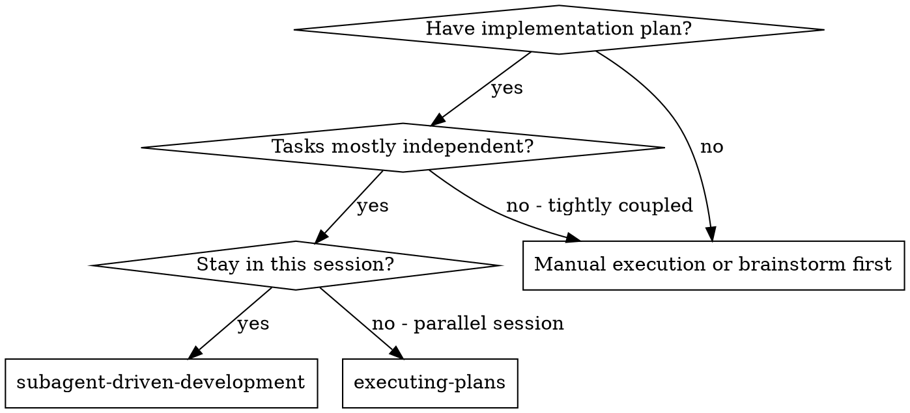
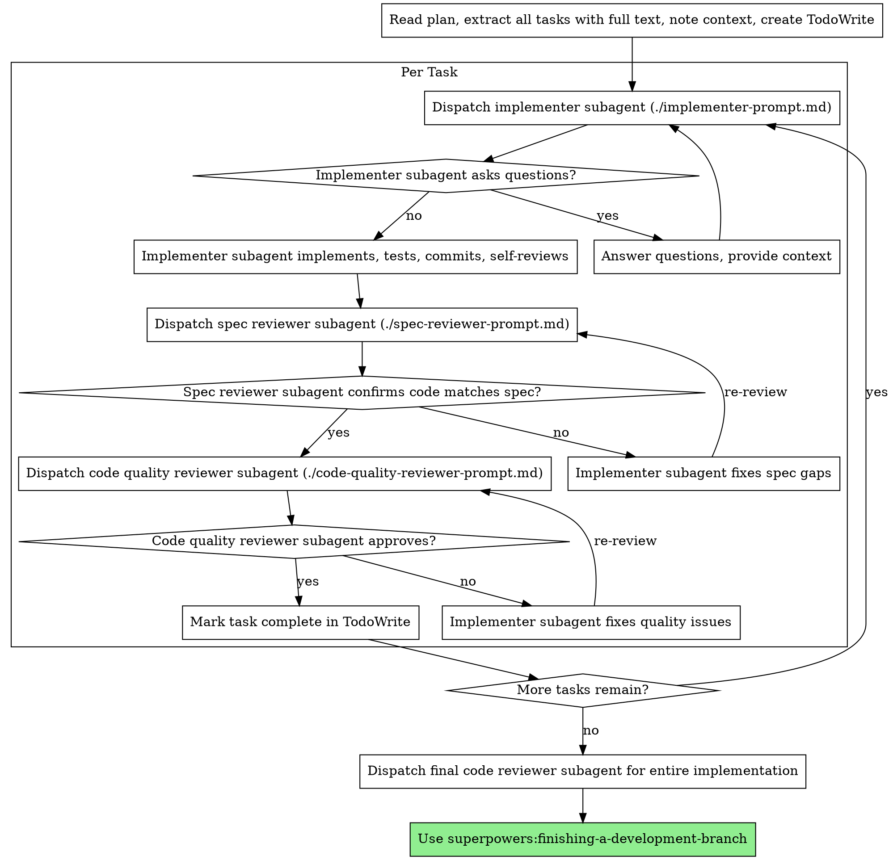

# 06 subagent-driven-development

## 速查卡 (Quick Reference)
| 维度           | 内容 |
|----------------|------|
| 触发时机       | 有实施计划、任务相对独立、在当前 session 内执行 |
| 调用链上游     | using-git-worktrees（必须先执行）、writing-plans（提供计划） |
| 调用链下游     | finishing-a-development-branch |
| 核心产出       | 每个任务依次完成：实现 → spec 合规审查 → 代码质量审查 → 标记完成 |
| 关联 Subagents | implementer, spec-reviewer, code-quality-reviewer |

---

## 一、原文

### SKILL.md

```
---
name: subagent-driven-development
description: Use when executing implementation plans with independent tasks in the current session
---

# Subagent-Driven Development

Execute plan by dispatching fresh subagent per task, with two-stage review after each: spec compliance review first, then code quality review.

**Why subagents:** You delegate tasks to specialized agents with isolated context. By precisely crafting their instructions and context, you ensure they stay focused and succeed at their task. They should never inherit your session's context or history — you construct exactly what they need. This also preserves your own context for coordination work.

**Core principle:** Fresh subagent per task + two-stage review (spec then quality) = high quality, fast iteration

## When to Use



**vs. Executing Plans (parallel session):**
- Same session (no context switch)
- Fresh subagent per task (no context pollution)
- Two-stage review after each task: spec compliance first, then code quality
- Faster iteration (no human-in-loop between tasks)

## The Process



## Model Selection

Use the least powerful model that can handle each role to conserve cost and increase speed.

**Mechanical implementation tasks** (isolated functions, clear specs, 1-2 files): use a fast, cheap model. Most implementation tasks are mechanical when the plan is well-specified.

**Integration and judgment tasks** (multi-file coordination, pattern matching, debugging): use a standard model.

**Architecture, design, and review tasks**: use the most capable available model.

**Task complexity signals:**
- Touches 1-2 files with a complete spec → cheap model
- Touches multiple files with integration concerns → standard model
- Requires design judgment or broad codebase understanding → most capable model

## Handling Implementer Status

Implementer subagents report one of four statuses. Handle each appropriately:

**DONE:** Proceed to spec compliance review.

**DONE_WITH_CONCERNS:** The implementer completed the work but flagged doubts. Read the concerns before proceeding. If the concerns are about correctness or scope, address them before review. If they're observations (e.g., "this file is getting large"), note them and proceed to review.

**NEEDS_CONTEXT:** The implementer needs information that wasn't provided. Provide the missing context and re-dispatch.

**BLOCKED:** The implementer cannot complete the task. Assess the blocker:
1. If it's a context problem, provide more context and re-dispatch with the same model
2. If the task requires more reasoning, re-dispatch with a more capable model
3. If the task is too large, break it into smaller pieces
4. If the plan itself is wrong, escalate to the human

**Never** ignore an escalation or force the same model to retry without changes. If the implementer said it's stuck, something needs to change.

## Prompt Templates

- `./implementer-prompt.md` - Dispatch implementer subagent
- `./spec-reviewer-prompt.md` - Dispatch spec compliance reviewer subagent
- `./code-quality-reviewer-prompt.md` - Dispatch code quality reviewer subagent

## Example Workflow

```
You: I'm using Subagent-Driven Development to execute this plan.

[Read plan file once: docs/superpowers/plans/feature-plan.md]
[Extract all 5 tasks with full text and context]
[Create TodoWrite with all tasks]

Task 1: Hook installation script

[Get Task 1 text and context (already extracted)]
[Dispatch implementation subagent with full task text + context]

Implementer: "Before I begin - should the hook be installed at user or system level?"

You: "User level (~/.config/superpowers/hooks/)"

Implementer: "Got it. Implementing now..."
[Later] Implementer:
  - Implemented install-hook command
  - Added tests, 5/5 passing
  - Self-review: Found I missed --force flag, added it
  - Committed

[Dispatch spec compliance reviewer]
Spec reviewer: ✅ Spec compliant - all requirements met, nothing extra

[Get git SHAs, dispatch code quality reviewer]
Code reviewer: Strengths: Good test coverage, clean. Issues: None. Approved.

[Mark Task 1 complete]

Task 2: Recovery modes

[Get Task 2 text and context (already extracted)]
[Dispatch implementation subagent with full task text + context]

Implementer: [No questions, proceeds]
Implementer:
  - Added verify/repair modes
  - 8/8 tests passing
  - Self-review: All good
  - Committed

[Dispatch spec compliance reviewer]
Spec reviewer: ❌ Issues:
  - Missing: Progress reporting (spec says "report every 100 items")
  - Extra: Added --json flag (not requested)

[Implementer fixes issues]
Implementer: Removed --json flag, added progress reporting

[Spec reviewer reviews again]
Spec reviewer: ✅ Spec compliant now

[Dispatch code quality reviewer]
Code reviewer: Strengths: Solid. Issues (Important): Magic number (100)

[Implementer fixes]
Implementer: Extracted PROGRESS_INTERVAL constant

[Code reviewer reviews again]
Code reviewer: ✅ Approved

[Mark Task 2 complete]

...

[After all tasks]
[Dispatch final code-reviewer]
Final reviewer: All requirements met, ready to merge

Done!
```

## Advantages

**vs. Manual execution:**
- Subagents follow TDD naturally
- Fresh context per task (no confusion)
- Parallel-safe (subagents don't interfere)
- Subagent can ask questions (before AND during work)

**vs. Executing Plans:**
- Same session (no handoff)
- Continuous progress (no waiting)
- Review checkpoints automatic

**Efficiency gains:**
- No file reading overhead (controller provides full text)
- Controller curates exactly what context is needed
- Subagent gets complete information upfront
- Questions surfaced before work begins (not after)

**Quality gates:**
- Self-review catches issues before handoff
- Two-stage review: spec compliance, then code quality
- Review loops ensure fixes actually work
- Spec compliance prevents over/under-building
- Code quality ensures implementation is well-built

**Cost:**
- More subagent invocations (implementer + 2 reviewers per task)
- Controller does more prep work (extracting all tasks upfront)
- Review loops add iterations
- But catches issues early (cheaper than debugging later)

## Red Flags

**Never:**
- Start implementation on main/master branch without explicit user consent
- Skip reviews (spec compliance OR code quality)
- Proceed with unfixed issues
- Dispatch multiple implementation subagents in parallel (conflicts)
- Make subagent read plan file (provide full text instead)
- Skip scene-setting context (subagent needs to understand where task fits)
- Ignore subagent questions (answer before letting them proceed)
- Accept "close enough" on spec compliance (spec reviewer found issues = not done)
- Skip review loops (reviewer found issues = implementer fixes = review again)
- Let implementer self-review replace actual review (both are needed)
- **Start code quality review before spec compliance is ✅** (wrong order)
- Move to next task while either review has open issues

**If subagent asks questions:**
- Answer clearly and completely
- Provide additional context if needed
- Don't rush them into implementation

**If reviewer finds issues:**
- Implementer (same subagent) fixes them
- Reviewer reviews again
- Repeat until approved
- Don't skip the re-review

**If subagent fails task:**
- Dispatch fix subagent with specific instructions
- Don't try to fix manually (context pollution)

## Integration

**Required workflow skills:**
- **superpowers:using-git-worktrees** - REQUIRED: Set up isolated workspace before starting
- **superpowers:writing-plans** - Creates the plan this skill executes
- **superpowers:requesting-code-review** - Code review template for reviewer subagents
- **superpowers:finishing-a-development-branch** - Complete development after all tasks

**Subagents should use:**
- **superpowers:test-driven-development** - Subagents follow TDD for each task

**Alternative workflow:**
- **superpowers:executing-plans** - Use for parallel session instead of same-session execution
```

---

### implementer-prompt.md

```
# Implementer Subagent Prompt Template

Use this template when dispatching an implementer subagent.

```
Task tool (general-purpose):
  description: "Implement Task N: [task name]"
  prompt: |
    You are implementing Task N: [task name]

    ## Task Description

    [FULL TEXT of task from plan - paste it here, don't make subagent read file]

    ## Context

    [Scene-setting: where this fits, dependencies, architectural context]

    ## Before You Begin

    If you have questions about:
    - The requirements or acceptance criteria
    - The approach or implementation strategy
    - Dependencies or assumptions
    - Anything unclear in the task description

    **Ask them now.** Raise any concerns before starting work.

    ## Your Job

    Once you're clear on requirements:
    1. Implement exactly what the task specifies
    2. Write tests (following TDD if task says to)
    3. Verify implementation works
    4. Commit your work
    5. Self-review (see below)
    6. Report back

    Work from: [directory]

    **While you work:** If you encounter something unexpected or unclear, **ask questions**.
    It's always OK to pause and clarify. Don't guess or make assumptions.

    ## Code Organization

    You reason best about code you can hold in context at once, and your edits are more
    reliable when files are focused. Keep this in mind:
    - Follow the file structure defined in the plan
    - Each file should have one clear responsibility with a well-defined interface
    - If a file you're creating is growing beyond the plan's intent, stop and report
      it as DONE_WITH_CONCERNS — don't split files on your own without plan guidance
    - If an existing file you're modifying is already large or tangled, work carefully
      and note it as a concern in your report
    - In existing codebases, follow established patterns. Improve code you're touching
      the way a good developer would, but don't restructure things outside your task.

    ## When You're in Over Your Head

    It is always OK to stop and say "this is too hard for me." Bad work is worse than
    no work. You will not be penalized for escalating.

    **STOP and escalate when:**
    - The task requires architectural decisions with multiple valid approaches
    - You need to understand code beyond what was provided and can't find clarity
    - You feel uncertain about whether your approach is correct
    - The task involves restructuring existing code in ways the plan didn't anticipate
    - You've been reading file after file trying to understand the system without progress

    **How to escalate:** Report back with status BLOCKED or NEEDS_CONTEXT. Describe
    specifically what you're stuck on, what you've tried, and what kind of help you need.
    The controller can provide more context, re-dispatch with a more capable model,
    or break the task into smaller pieces.

    ## Before Reporting Back: Self-Review

    Review your work with fresh eyes. Ask yourself:

    **Completeness:**
    - Did I fully implement everything in the spec?
    - Did I miss any requirements?
    - Are there edge cases I didn't handle?

    **Quality:**
    - Is this my best work?
    - Are names clear and accurate (match what things do, not how they work)?
    - Is the code clean and maintainable?

    **Discipline:**
    - Did I avoid overbuilding (YAGNI)?
    - Did I only build what was requested?
    - Did I follow existing patterns in the codebase?

    **Testing:**
    - Do tests actually verify behavior (not just mock behavior)?
    - Did I follow TDD if required?
    - Are tests comprehensive?

    If you find issues during self-review, fix them now before reporting.

    ## Report Format

    When done, report:
    - **Status:** DONE | DONE_WITH_CONCERNS | BLOCKED | NEEDS_CONTEXT
    - What you implemented (or what you attempted, if blocked)
    - What you tested and test results
    - Files changed
    - Self-review findings (if any)
    - Any issues or concerns

    Use DONE_WITH_CONCERNS if you completed the work but have doubts about correctness.
    Use BLOCKED if you cannot complete the task. Use NEEDS_CONTEXT if you need
    information that wasn't provided. Never silently produce work you're unsure about.
```
```

---

### spec-reviewer-prompt.md

```
# Spec Compliance Reviewer Prompt Template

Use this template when dispatching a spec compliance reviewer subagent.

**Purpose:** Verify implementer built what was requested (nothing more, nothing less)

```
Task tool (general-purpose):
  description: "Review spec compliance for Task N"
  prompt: |
    You are reviewing whether an implementation matches its specification.

    ## What Was Requested

    [FULL TEXT of task requirements]

    ## What Implementer Claims They Built

    [From implementer's report]

    ## CRITICAL: Do Not Trust the Report

    The implementer finished suspiciously quickly. Their report may be incomplete,
    inaccurate, or optimistic. You MUST verify everything independently.

    **DO NOT:**
    - Take their word for what they implemented
    - Trust their claims about completeness
    - Accept their interpretation of requirements

    **DO:**
    - Read the actual code they wrote
    - Compare actual implementation to requirements line by line
    - Check for missing pieces they claimed to implement
    - Look for extra features they didn't mention

    ## Your Job

    Read the implementation code and verify:

    **Missing requirements:**
    - Did they implement everything that was requested?
    - Are there requirements they skipped or missed?
    - Did they claim something works but didn't actually implement it?

    **Extra/unneeded work:**
    - Did they build things that weren't requested?
    - Did they over-engineer or add unnecessary features?
    - Did they add "nice to haves" that weren't in spec?

    **Misunderstandings:**
    - Did they interpret requirements differently than intended?
    - Did they solve the wrong problem?
    - Did they implement the right feature but wrong way?

    **Verify by reading code, not by trusting report.**

    Report:
    - ✅ Spec compliant (if everything matches after code inspection)
    - ❌ Issues found: [list specifically what's missing or extra, with file:line references]
```
```

---

### code-quality-reviewer-prompt.md

```
# Code Quality Reviewer Prompt Template

Use this template when dispatching a code quality reviewer subagent.

**Purpose:** Verify implementation is well-built (clean, tested, maintainable)

**Only dispatch after spec compliance review passes.**

```
Task tool (superpowers:code-reviewer):
  Use template at requesting-code-review/code-reviewer.md

  WHAT_WAS_IMPLEMENTED: [from implementer's report]
  PLAN_OR_REQUIREMENTS: Task N from [plan-file]
  BASE_SHA: [commit before task]
  HEAD_SHA: [current commit]
  DESCRIPTION: [task summary]
```

**In addition to standard code quality concerns, the reviewer should check:**
- Does each file have one clear responsibility with a well-defined interface?
- Are units decomposed so they can be understood and tested independently?
- Is the implementation following the file structure from the plan?
- Did this implementation create new files that are already large, or significantly grow existing files? (Don't flag pre-existing file sizes — focus on what this change contributed.)

**Code reviewer returns:** Strengths, Issues (Critical/Important/Minor), Assessment
```

---

## 二、中文翻译

### SKILL.md 翻译

**名称：** subagent-driven-development
**描述：** 当在当前 session 内执行含有独立任务的实施计划时使用

---

# Subagent 驱动开发

通过为每个任务派发全新的 subagent 来执行计划，每次执行后进行两阶段审查：先进行 spec 合规性审查，再进行代码质量审查。

**为什么使用 subagents：** 你将任务委托给具有隔离上下文的专门 agent。通过精确构建它们的指令和上下文，确保它们保持专注并成功完成任务。它们绝不应继承你 session 的上下文或历史——你精确构建它们所需的内容。这也为控制器 agent 保留了自身的上下文用于协调工作。

**核心原则：** 每个任务一个全新 subagent + 两阶段审查（先 spec 后质量）= 高质量、快速迭代

**何时使用**

*（原文此处为 Graphviz dot 格式流程图，ASCII 重绘版本见 3.4 节）*

**vs. Executing Plans（并行 session）：**
- 同一 session（无上下文切换）
- 每个任务全新 subagent（无上下文污染）
- 每个任务后两阶段审查：先 spec 合规性，后代码质量
- 更快迭代（任务之间无需人工介入）

**流程**

*（原文此处为 Graphviz dot 格式流程图，ASCII 重绘版本见 3.4 节）*

**模型选择**

使用能胜任每个角色的最低配置模型，以节省成本并提高速度。

**机械性实现任务**（独立函数、清晰规格、1-2 个文件）：使用快速、低成本模型。当计划规格明确时，大多数实现任务都是机械性的。

**集成与判断任务**（多文件协调、模式匹配、调试）：使用标准模型。

**架构、设计和审查任务**：使用最强能力的可用模型。

**任务复杂度信号：**
- 涉及 1-2 个文件且规格完整 → 低成本模型
- 涉及多文件且有集成问题 → 标准模型
- 需要设计判断或广泛代码库理解 → 最强能力模型

**处理 implementer 状态**

implementer subagent 报告四种状态之一。对每种状态做出适当处理：

**DONE：** 进行 spec 合规性审查。

**DONE_WITH_CONCERNS：** implementer 完成了工作但标记了疑虑。在继续之前先阅读疑虑。如果疑虑涉及正确性或范围，在审查之前先处理它们。如果只是观察性意见（例如"这个文件越来越大"），记录下来并继续审查。

**NEEDS_CONTEXT：** implementer 需要未提供的信息。提供缺失的上下文并重新派发。

**BLOCKED：** implementer 无法完成任务。评估阻塞原因：
1. 如果是上下文问题，提供更多上下文并以相同模型重新派发
2. 如果任务需要更多推理能力，用更强能力的模型重新派发
3. 如果任务太大，拆分成更小的部分
4. 如果计划本身有问题，上报给人工

**绝不**忽略上报或强迫同一模型在不做任何改变的情况下重试。如果 implementer 说它卡住了，就必须改变某些东西。

**Prompt 模板**

- `./implementer-prompt.md` - 派发 implementer subagent
- `./spec-reviewer-prompt.md` - 派发 spec 合规性审查 subagent
- `./code-quality-reviewer-prompt.md` - 派发代码质量审查 subagent

**优势**

vs. 手动执行：
- subagent 自然遵循 TDD
- 每个任务全新上下文（无混淆）
- 并行安全（subagent 互不干扰）
- subagent 可以提问（工作前后都可以）

vs. Executing Plans：
- 同一 session（无交接）
- 持续推进（无需等待）
- 审查检查点自动进行

效率提升：
- 无文件读取开销（控制器提供完整文本）
- 控制器精确筛选所需上下文
- subagent 提前获得完整信息
- 问题在工作开始前就浮现（而非之后）

质量门控：
- 自我审查在交接前捕获问题
- 两阶段审查：spec 合规性，然后代码质量
- 审查循环确保修复真正有效
- spec 合规性防止过度开发/开发不足
- 代码质量确保实现构建良好

成本：
- 更多 subagent 调用（每个任务：implementer + 2 个 reviewer）
- 控制器需要更多准备工作（提前提取所有任务）
- 审查循环增加迭代次数
- 但能尽早捕获问题（比后期调试成本更低）

**红线（Red Flags）**

绝不：
- 未经用户明确同意就在 main/master 分支开始实现
- 跳过审查（spec 合规性或代码质量，两者都不能跳过）
- 带着未修复的问题继续
- 并行派发多个 implementation subagent（会冲突）
- 让 subagent 读取计划文件（应提供完整文本）
- 省略场景设置上下文（subagent 需要理解任务所处的位置）
- 忽略 subagent 的问题（在让它们继续之前先回答）
- 对 spec 合规性接受"差不多够用"（reviewer 找到问题 = 未完成）
- 跳过审查循环（reviewer 找到问题 = implementer 修复 = 再次审查）
- 用 implementer 的自我审查替代真正的审查（两者都需要）
- **在 spec 合规性通过 ✅ 之前开始代码质量审查**（顺序错误）
- 在任一审查有未解决问题时进入下一个任务

**集成**

必需工作流 skills：
- **superpowers:using-git-worktrees** - 必须：开始前设置隔离工作区
- **superpowers:writing-plans** - 创建本 skill 执行的计划
- **superpowers:requesting-code-review** - reviewer subagent 使用的代码审查模板
- **superpowers:finishing-a-development-branch** - 所有任务完成后收尾开发分支

Subagents 应使用：
- **superpowers:test-driven-development** - subagent 为每个任务遵循 TDD

替代工作流：
- **superpowers:executing-plans** - 用于并行 session 而非同 session 执行

---

### implementer-prompt.md 翻译

# Implementer Subagent Prompt 模板

派发 implementer subagent 时使用此模板。

**Task 工具（通用）：**
- description: "实现任务 N：[任务名称]"
- prompt 内容：

你正在实现任务 N：[任务名称]

**任务描述**

[来自计划的任务完整文本——粘贴到此处，不要让 subagent 自己读文件]

**上下文**

[场景设置：此任务所处位置、依赖关系、架构上下文]

**开始之前**

如果你对以下方面有疑问：
- 需求或验收标准
- 方法或实现策略
- 依赖关系或假设
- 任务描述中不清楚的任何内容

**现在就问。** 在开始工作之前提出任何疑虑。

**你的工作**

一旦你明确了需求：
1. 精确实现任务规格中的内容
2. 编写测试（如果任务要求，遵循 TDD）
3. 验证实现是否有效
4. 提交你的工作
5. 自我审查（见下文）
6. 汇报结果

工作目录：[目录]

**工作过程中：** 如果遇到意外或不清楚的情况，**提问**。随时暂停澄清是完全可以的。不要猜测或做假设。

**代码组织**

你对能在上下文中一次性掌握的代码推理效果最好，文件聚焦时你的编辑也更可靠。牢记：
- 遵循计划中定义的文件结构
- 每个文件应有一个明确的职责和定义清晰的接口
- 如果你正在创建的文件超出了计划的意图，停下来以 DONE_WITH_CONCERNS 汇报——不要在没有计划指导的情况下自行拆分文件
- 如果你正在修改的现有文件已经很大或很乱，小心操作并在报告中记录为疑虑
- 在现有代码库中，遵循已建立的模式。像优秀开发者那样改进你接触到的代码，但不要重构任务范围之外的东西。

**当你力不从心时**

随时都可以停下来说"这对我来说太难了"。糟糕的工作比没有工作更糟。上报不会受到惩罚。

在以下情况**停止并上报**：
- 任务需要有多种有效方法的架构决策
- 你需要理解提供内容之外的代码但找不到清晰答案
- 你对自己的方法是否正确感到不确定
- 任务涉及以计划未预见的方式重构现有代码
- 你一直在读文件试图理解系统却没有进展

**如何上报：** 以 BLOCKED 或 NEEDS_CONTEXT 状态汇报。具体描述你卡在哪里、尝试了什么、需要什么帮助。控制器可以提供更多上下文、用更强能力的模型重新派发，或将任务拆分成更小的部分。

**汇报前：自我审查**

用全新的眼光审视你的工作。问自己：

完整性：
- 我是否完全实现了规格中的所有内容？
- 是否遗漏了任何需求？
- 是否有我没处理的边界情况？

质量：
- 这是我最好的工作吗？
- 名称是否清晰准确（匹配事物的功能，而非实现方式）？
- 代码是否干净可维护？

纪律：
- 我是否避免了过度构建（YAGNI）？
- 我是否只构建了被要求的内容？
- 我是否遵循了代码库中的已有模式？

测试：
- 测试是否真正验证了行为（而非只是 mock 行为）？
- 如果要求，是否遵循了 TDD？
- 测试是否全面？

如果在自我审查中发现问题，在汇报前立即修复。

**汇报格式**

完成后汇报：
- **状态：** DONE | DONE_WITH_CONCERNS | BLOCKED | NEEDS_CONTEXT
- 你实现了什么（或如果被阻塞，尝试了什么）
- 你测试了什么以及测试结果
- 修改的文件
- 自我审查发现（如有）
- 任何问题或疑虑

如果你完成了工作但对正确性有疑虑，使用 DONE_WITH_CONCERNS。如果你无法完成任务，使用 BLOCKED。如果你需要未提供的信息，使用 NEEDS_CONTEXT。永远不要默默地产出你不确定的工作。

---

### spec-reviewer-prompt.md 翻译

# Spec 合规性 Reviewer Prompt 模板

派发 spec 合规性 reviewer subagent 时使用此模板。

**目的：** 验证 implementer 构建了被要求的内容（不多也不少）

**Task 工具（通用）：**
- description: "审查任务 N 的 spec 合规性"
- prompt 内容：

你正在审查一个实现是否与其规格匹配。

**被要求的内容**

[任务需求的完整文本]

**Implementer 声称他们构建了什么**

[来自 implementer 的报告]

**关键：不要相信报告**

implementer 完成得快得可疑。他们的报告可能不完整、不准确或过于乐观。你**必须**独立验证所有内容。

不要：
- 相信他们实现了什么的说法
- 信任他们关于完整性的声明
- 接受他们对需求的解释

要：
- 阅读他们实际编写的代码
- 逐行对比实际实现与需求
- 检查他们声称已实现但缺失的部分
- 查找他们未提及的额外功能

**你的工作**

阅读实现代码并验证：

缺失的需求：
- 他们是否实现了所有被要求的内容？
- 是否有他们跳过或遗漏的需求？
- 他们是否声称某些功能有效但实际上没有实现？

额外/不需要的工作：
- 他们是否构建了未被要求的东西？
- 他们是否过度工程化或添加了不必要的功能？
- 他们是否添加了规格中没有的"锦上添花"功能？

误解：
- 他们是否以与预期不同的方式解读了需求？
- 他们是否解决了错误的问题？
- 他们是否实现了正确的功能但方式错误？

**通过阅读代码而非信任报告来验证。**

报告：
- ✅ Spec 合规（如果代码检查后一切匹配）
- ❌ 发现问题：[具体列出缺失或多余的内容，附带 file:line 引用]

---

### code-quality-reviewer-prompt.md 翻译

# 代码质量 Reviewer Prompt 模板

派发代码质量 reviewer subagent 时使用此模板。

**目的：** 验证实现构建良好（干净、经过测试、可维护）

**仅在 spec 合规性审查通过后才派发。**

**Task 工具（superpowers:code-reviewer）：**
- 使用 requesting-code-review/code-reviewer.md 中的模板
- WHAT_WAS_IMPLEMENTED: [来自 implementer 的报告]
- PLAN_OR_REQUIREMENTS: 来自 [plan-file] 的任务 N
- BASE_SHA: [任务前的 commit]
- HEAD_SHA: [当前 commit]
- DESCRIPTION: [任务摘要]

**除标准代码质量问题外，reviewer 还应检查：**
- 每个文件是否有一个明确的职责和定义清晰的接口？
- 单元是否被分解为可以独立理解和测试的部分？
- 实现是否遵循了计划中的文件结构？
- 这次实现是否创建了已经很大的新文件，或显著增大了现有文件？（不要标记既有文件大小——关注这次变更贡献了什么。）

**代码 reviewer 返回：** 优点、问题（Critical/Important/Minor）、评估结论

---

## 三、剖析解读

### 3.1 功能与定位

SDD（Subagent-Driven Development）是 superpowers 工具链中"执行阶段"的核心 skill，解决一个根本性问题：**如何在不牺牲上下文隔离的前提下，在同一 session 内高质量、自动化地执行多任务计划？**

核心价值公式：

```
新鲜 subagent（零上下文污染）
+ 两阶段审查（spec 合规 → 代码质量）
= 高质量 + 快速迭代
```

**控制器的核心职责**不是执行，而是**上下文构造**：

- 一次性读取计划，提取所有任务文本
- 为每个 subagent 精确组装它需要的一切（任务描述 + 场景上下文）
- 永远不让 subagent 自己去读文件、理解系统

这个设计消除了两类污染：(1) subagent 因继承前一个任务的上下文而产生偏差；(2) 控制器 agent 因执行细节而消耗有限的上下文窗口。

### 3.2 使用场景与案例

**典型场景：** 假设有 8 个相对独立的优惠券系统任务，选择 SDD——

控制器读取计划提取全部任务后，针对 Task 1：
1. dispatch implementer（附带完整 task 文本 + 上下文）
2. implementer 完成后报告 DONE
3. dispatch spec-reviewer（验证没有多做/少做）
4. spec-reviewer 通过 ✅ 后 dispatch code-quality-reviewer
5. code-quality-reviewer 通过 ✅ 后标记 Task 1 完成
6. 进入 Task 2，如此循环直到所有任务完成

**四种 implementer 状态处理对比：**

| 状态 | 含义 | 控制器行为 |
|------|------|-----------|
| DONE | 完成 | 进入 spec review |
| DONE_WITH_CONCERNS | 完成但有疑虑 | 先读疑虑，评估后决定是否继续 review |
| NEEDS_CONTEXT | 缺少信息 | 提供缺失上下文，重新 dispatch |
| BLOCKED | 无法完成 | 诊断原因：更多上下文 / 更强模型 / 拆分任务 / 人工介入 |

**模型选择策略**（成本优化关键）：

| 任务类型 | 特征 | 模型 |
|---------|------|------|
| 机械性实现 | 1-2 文件、规格清晰 | fast/cheap |
| 集成与判断 | 多文件协调、模式匹配 | standard |
| 架构与审查 | 设计判断、广泛代码库理解 | most capable |

### 3.3 Subagents / References 深度解读

**implementer-prompt.md — 实现 subagent 指令模板**

该模板的结构设计体现了几个关键工程思想：

1. **"Before You Begin" 优先问答**：在工作开始前就强制暴露疑问，防止 subagent 带着假设盲目实现后返工。

2. **DONE_WITH_CONCERNS 机制**：不强迫 subagent 在确定性不足时做出非此即彼的选择。疑虑可以透明传递给控制器，而非隐藏在 DONE 下。

3. **Code Organization 章节的"不超出边界"原则**：文件变大 → 报 DONE_WITH_CONCERNS；存量代码乱 → 记录为 concern。不擅自重构。这防止了"顺手优化"导致的 spec 漂移。

4. **升级条件明确化（When You're in Over Your Head）**：降低了 subagent 卡死的风险，BLOCKED/NEEDS_CONTEXT 是明确的出路，不是失败。

5. **Self-Review checklist**：四个维度（完整性/质量/纪律/测试），在正式审查前自查一遍，减少低级问题流入 reviewer。

**spec-reviewer-prompt.md — spec 合规性审查模板**

核心指令：**"Do NOT trust the report"**（不要相信报告）

这是整个 SDD 系统中最犀利的一句话。背后逻辑：
- implementer 在同一上下文中完成工作，可能存在确认偏差
- implementer 的报告是主观的，reviewer 的任务是客观的
- reviewer 必须**独立读代码**，逐行对比需求

三类检查维度：
1. **缺失需求**：实现少于要求
2. **额外功能**：实现多于要求（过度工程化、擅加功能）
3. **需求误解**：实现了错误的理解

注意：spec reviewer 不管代码质量——那是 code quality reviewer 的职责。职责严格分离，避免混淆优先级。

**code-quality-reviewer-prompt.md — 代码质量审查模板**

该模板的核心约束：**仅在 spec compliance ✅ 后才 dispatch**。

原因：如果 spec 不合规，质量修复等于白做——可能在下一轮 spec 修复中被推翻。

与 spec reviewer 的差异：
- spec reviewer 问"做了什么"
- code quality reviewer 问"做得怎么样"

额外检查项（SDD 特有，超出标准 code review）：
- 文件职责单一性（每文件一个明确职责）
- 独立可测试性（单元可独立理解和测试）
- 遵循计划文件结构
- **只关注本次变更带来的文件增长**，不标记既有大文件

### 3.4 流程图 / 示意图

**SDD 完整执行流程（ASCII 重绘）：**

```
[读取计划，提取所有任务全文，记录上下文，创建 TodoWrite]
                         |
                         v
               +---------+----------+
               |  Per Task 循环     |
               |                    |
               |  [dispatch implementer subagent]
               |         |          |
               |    有问题?          |
               |   /      \         |
               |  yes      no       |
               |   |        |       |
               | [回答问题]  |       |
               |   |        |       |
               |   +--------+       |
               |        |           |
               | [implementer 实现 + 测试 + commit + 自我审查]
               |        |           |
               | [dispatch spec-reviewer]
               |        |           |
               |  spec OK?          |
               |   /    \           |
               |  no    yes         |
               |   |     |          |
               | [implementer 修复 spec 问题]
               |   |     |          |
               | re-review          |
               |         |          |
               | [dispatch code-quality-reviewer]
               |         |          |
               | quality OK?        |
               |   /     \          |
               |  no     yes        |
               |   |      |         |
               | [implementer 修复质量问题]
               |   |      |         |
               | re-review          |
               |          |         |
               | [TodoWrite 标记任务完成]
               |          |         |
               +----------+         |
                     |              |
              还有任务?             |
              /      \              |
            yes       no            |
             |         |
     [回到循环顶]    [dispatch 最终代码 reviewer（整体实现）]
                           |
                           v
               [superpowers:finishing-a-development-branch]
```

**"何时使用 SDD" 决策树：**

```
有实施计划?
├── No  → 先手动执行或头脑风暴
└── Yes
    任务大致独立?
    ├── No (紧耦合) → 先手动执行或头脑风暴
    └── Yes
        留在当前 session?
        ├── No (需要并行 session) → executing-plans
        └── Yes → subagent-driven-development  ✓
```

### 3.5 与其他 Skills 的协作关系

| 协作 Skill | 关系类型 | 说明 |
|------------|----------|------|
| using-git-worktrees | 上游（必须） | SDD 执行前必须先建立隔离工作区，防止在 main 分支直接工作 |
| writing-plans | 上游（输入源） | 提供 SDD 消费的计划文件，任务文本从此来 |
| finishing-a-development-branch | 下游（收尾） | 所有任务完成后，执行分支收尾流程（最终 review、合并准备） |
| test-driven-development | 内部（subagent 使用） | implementer subagent 在实现每个任务时遵循 TDD |
| requesting-code-review | 内部（reviewer 使用） | code-quality-reviewer 使用此 skill 的 code-reviewer.md 模板 |
| executing-plans | 替代方案 | 当需要并行 session（非同 session）执行计划时使用，SDD 的对等替代 |
