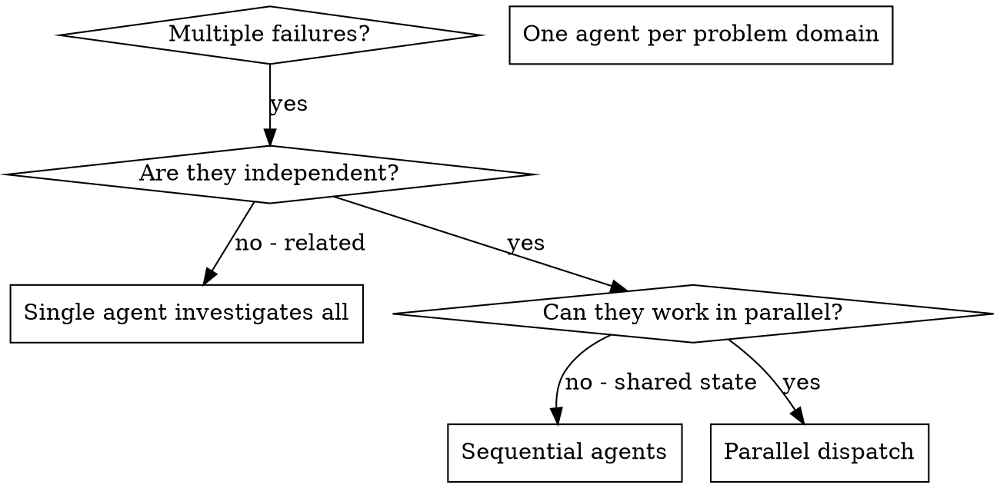
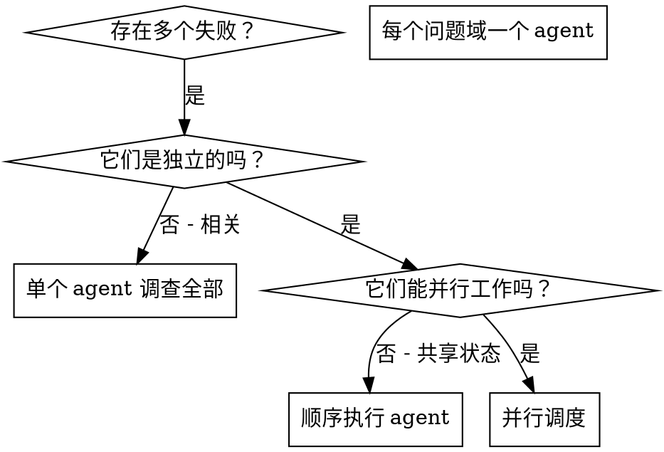

# 07 dispatching-parallel-agents

## 速查卡 (Quick Reference)
| 维度           | 内容 |
|----------------|------|
| 触发时机       | 面临 2+ 个相互独立、无共享状态、无顺序依赖的任务时 |
| 调用链上游     | executing-plans、subagent-driven-development |
| 调用链下游     | 无固定下游（完成后回到调用方流程） |
| 核心产出       | 多个并行 agent 各自的执行结果与摘要，由协调者整合 |
| 关联 Subagents | 无 |

---

## 一、原文

### SKILL.md

---
name: dispatching-parallel-agents
description: Use when facing 2+ independent tasks that can be worked on without shared state or sequential dependencies
---

# Dispatching Parallel Agents

## Overview

You delegate tasks to specialized agents with isolated context. By precisely crafting their instructions and context, you ensure they stay focused and succeed at their task. They should never inherit your session's context or history — you construct exactly what they need. This also preserves your own context for coordination work.

When you have multiple unrelated failures (different test files, different subsystems, different bugs), investigating them sequentially wastes time. Each investigation is independent and can happen in parallel.

**Core principle:** Dispatch one agent per independent problem domain. Let them work concurrently.

## When to Use



**Use when:**
- 3+ test files failing with different root causes
- Multiple subsystems broken independently
- Each problem can be understood without context from others
- No shared state between investigations

**Don't use when:**
- Failures are related (fix one might fix others)
- Need to understand full system state
- Agents would interfere with each other

## The Pattern

### 1. Identify Independent Domains

Group failures by what's broken:
- File A tests: Tool approval flow
- File B tests: Batch completion behavior
- File C tests: Abort functionality

Each domain is independent - fixing tool approval doesn't affect abort tests.

### 2. Create Focused Agent Tasks

Each agent gets:
- **Specific scope:** One test file or subsystem
- **Clear goal:** Make these tests pass
- **Constraints:** Don't change other code
- **Expected output:** Summary of what you found and fixed

### 3. Dispatch in Parallel

```typescript
// In Claude Code / AI environment
Task("Fix agent-tool-abort.test.ts failures")
Task("Fix batch-completion-behavior.test.ts failures")
Task("Fix tool-approval-race-conditions.test.ts failures")
// All three run concurrently
```

### 4. Review and Integrate

When agents return:
- Read each summary
- Verify fixes don't conflict
- Run full test suite
- Integrate all changes

## Agent Prompt Structure

Good agent prompts are:
1. **Focused** - One clear problem domain
2. **Self-contained** - All context needed to understand the problem
3. **Specific about output** - What should the agent return?

```markdown
Fix the 3 failing tests in src/agents/agent-tool-abort.test.ts:

1. "should abort tool with partial output capture" - expects 'interrupted at' in message
2. "should handle mixed completed and aborted tools" - fast tool aborted instead of completed
3. "should properly track pendingToolCount" - expects 3 results but gets 0

These are timing/race condition issues. Your task:

1. Read the test file and understand what each test verifies
2. Identify root cause - timing issues or actual bugs?
3. Fix by:
   - Replacing arbitrary timeouts with event-based waiting
   - Fixing bugs in abort implementation if found
   - Adjusting test expectations if testing changed behavior

Do NOT just increase timeouts - find the real issue.

Return: Summary of what you found and what you fixed.
```

## Common Mistakes

**❌ Too broad:** "Fix all the tests" - agent gets lost
**✅ Specific:** "Fix agent-tool-abort.test.ts" - focused scope

**❌ No context:** "Fix the race condition" - agent doesn't know where
**✅ Context:** Paste the error messages and test names

**❌ No constraints:** Agent might refactor everything
**✅ Constraints:** "Do NOT change production code" or "Fix tests only"

**❌ Vague output:** "Fix it" - you don't know what changed
**✅ Specific:** "Return summary of root cause and changes"

## When NOT to Use

**Related failures:** Fixing one might fix others - investigate together first
**Need full context:** Understanding requires seeing entire system
**Exploratory debugging:** You don't know what's broken yet
**Shared state:** Agents would interfere (editing same files, using same resources)

## Real Example from Session

**Scenario:** 6 test failures across 3 files after major refactoring

**Failures:**
- agent-tool-abort.test.ts: 3 failures (timing issues)
- batch-completion-behavior.test.ts: 2 failures (tools not executing)
- tool-approval-race-conditions.test.ts: 1 failure (execution count = 0)

**Decision:** Independent domains - abort logic separate from batch completion separate from race conditions

**Dispatch:**
```
Agent 1 → Fix agent-tool-abort.test.ts
Agent 2 → Fix batch-completion-behavior.test.ts
Agent 3 → Fix tool-approval-race-conditions.test.ts
```

**Results:**
- Agent 1: Replaced timeouts with event-based waiting
- Agent 2: Fixed event structure bug (threadId in wrong place)
- Agent 3: Added wait for async tool execution to complete

**Integration:** All fixes independent, no conflicts, full suite green

**Time saved:** 3 problems solved in parallel vs sequentially

## Key Benefits

1. **Parallelization** - Multiple investigations happen simultaneously
2. **Focus** - Each agent has narrow scope, less context to track
3. **Independence** - Agents don't interfere with each other
4. **Speed** - 3 problems solved in time of 1

## Verification

After agents return:
1. **Review each summary** - Understand what changed
2. **Check for conflicts** - Did agents edit same code?
3. **Run full suite** - Verify all fixes work together
4. **Spot check** - Agents can make systematic errors

## Real-World Impact

From debugging session (2025-10-03):
- 6 failures across 3 files
- 3 agents dispatched in parallel
- All investigations completed concurrently
- All fixes integrated successfully
- Zero conflicts between agent changes

---

## 二、中文翻译

### SKILL.md 翻译

---
name: dispatching-parallel-agents
description: 当面临 2 个或更多相互独立、无共享状态或顺序依赖的任务时使用
---

# 并行 Agent 调度

## 概述

你将任务委派给具有隔离上下文的专用 agent。通过精确构建它们的指令和上下文，确保它们保持专注并成功完成任务。这些 agent 不应继承你会话的上下文或历史——你为它们精确构建所需的一切。这也为你自己的协调工作保留了上下文。

当你面临多个不相关的失败（不同的测试文件、不同的子系统、不同的 bug）时，按顺序逐一排查会浪费时间。每项调查都是独立的，可以并行进行。

**核心原则：** 每个独立问题域派发一个 agent，让它们并发工作。

## 何时使用



**适用场景：**
- 3 个以上测试文件因不同根本原因失败
- 多个子系统独立损坏
- 每个问题无需了解其他问题的上下文即可理解
- 各调查之间无共享状态

**不适用场景：**
- 失败相互关联（修复一个可能修复其他）
- 需要了解完整系统状态
- Agent 之间会相互干扰

## 模式

### 1. 识别独立域

按照损坏内容对失败进行分组：
- 文件 A 测试：工具审批流程
- 文件 B 测试：批量完成行为
- 文件 C 测试：中止功能

每个域都是独立的——修复工具审批不会影响中止测试。

### 2. 创建专注的 Agent 任务

每个 agent 获得：
- **具体范围：** 一个测试文件或子系统
- **明确目标：** 使这些测试通过
- **约束条件：** 不修改其他代码
- **预期输出：** 发现和修复内容的摘要

### 3. 并行调度

```typescript
// 在 Claude Code / AI 环境中
Task("修复 agent-tool-abort.test.ts 失败")
Task("修复 batch-completion-behavior.test.ts 失败")
Task("修复 tool-approval-race-conditions.test.ts 失败")
// 三者并发运行
```

### 4. 审查与整合

Agent 返回时：
- 阅读每份摘要
- 验证修复不冲突
- 运行完整测试套件
- 整合所有变更

## Agent 提示结构

好的 agent 提示应该：
1. **专注** - 一个明确的问题域
2. **自包含** - 包含理解问题所需的全部上下文
3. **输出明确** - Agent 应该返回什么？

```markdown
修复 src/agents/agent-tool-abort.test.ts 中 3 个失败的测试：

1. "should abort tool with partial output capture" - 期望消息中包含 'interrupted at'
2. "should handle mixed completed and aborted tools" - 快速工具被中止而非完成
3. "should properly track pendingToolCount" - 期望 3 个结果但得到 0

这些是时序/竞态条件问题。你的任务：

1. 阅读测试文件，理解每个测试验证的内容
2. 识别根本原因——是时序问题还是实际 bug？
3. 通过以下方式修复：
   - 将任意超时替换为基于事件的等待
   - 如发现中止实现中的 bug 则进行修复
   - 如测试行为发生变化则调整测试期望

不要仅仅增加超时时间——找到真正的问题。

返回：你发现和修复内容的摘要。
```

## 常见错误

**❌ 范围过宽：** "修复所有测试" - agent 会迷失
**✅ 具体明确：** "修复 agent-tool-abort.test.ts" - 专注的范围

**❌ 缺乏上下文：** "修复竞态条件" - agent 不知道在哪里
**✅ 提供上下文：** 粘贴错误信息和测试名称

**❌ 无约束：** Agent 可能重构所有内容
**✅ 有约束：** "不要修改生产代码" 或 "仅修复测试"

**❌ 输出模糊：** "修复它" - 你不知道什么改变了
**✅ 输出明确：** "返回根本原因和变更的摘要"

## 不适用场景

**相关失败：** 修复一个可能修复其他——先一起调查
**需要完整上下文：** 理解需要查看整个系统
**探索性调试：** 你还不知道什么出了问题
**共享状态：** Agent 会相互干扰（编辑相同文件、使用相同资源）

## 来自真实会话的示例

**场景：** 重大重构后 3 个文件中 6 个测试失败

**失败情况：**
- agent-tool-abort.test.ts：3 个失败（时序问题）
- batch-completion-behavior.test.ts：2 个失败（工具未执行）
- tool-approval-race-conditions.test.ts：1 个失败（执行次数 = 0）

**决策：** 独立域——中止逻辑与批量完成与竞态条件各自独立

**调度：**
```
Agent 1 → 修复 agent-tool-abort.test.ts
Agent 2 → 修复 batch-completion-behavior.test.ts
Agent 3 → 修复 tool-approval-race-conditions.test.ts
```

**结果：**
- Agent 1：将超时替换为基于事件的等待
- Agent 2：修复事件结构 bug（threadId 放错位置）
- Agent 3：添加等待异步工具执行完成

**整合：** 所有修复相互独立，无冲突，完整套件通过

**节省时间：** 3 个问题并行解决而非顺序解决

## 核心优势

1. **并行化** - 多个调查同时进行
2. **专注** - 每个 agent 范围窄，需要追踪的上下文少
3. **独立性** - Agent 之间不相互干扰
4. **速度** - 在解决 1 个问题的时间内解决 3 个问题

## 验证

Agent 返回后：
1. **审查每份摘要** - 理解发生了什么变化
2. **检查冲突** - Agent 是否编辑了相同的代码？
3. **运行完整套件** - 验证所有修复协同工作
4. **抽查** - Agent 可能会犯系统性错误

## 真实世界影响

来自调试会话（2025-10-03）：
- 3 个文件中 6 个失败
- 3 个 agent 并行调度
- 所有调查并发完成
- 所有修复成功整合
- Agent 变更之间零冲突

---

## 三、剖析解读

### 3.1 功能与定位

dispatching-parallel-agents 是执行阶段的**时间加速器**，而非独立的工作流编排器。

它的核心价值在于一个简单的洞察：**当多个任务之间没有依赖关系时，串行执行纯粹是浪费时间**。这个 skill 将"并行执行"这一直觉系统化为可操作的模式。

定位上，它是一个**内嵌加速器**：在 executing-plans 或 subagent-driven-development 的执行阶段内部被调用，完成后将结果交回给调用方的协调流程，本身不负责最终整合决策。

两个关键设计原则：
1. **上下文隔离**：每个 agent 只获得它需要的上下文，不继承调用方的会话历史。这既保证了 agent 的专注度，也保护了协调者自身的上下文不被稀释。
2. **独立性判断前置**：必须先确认任务真正独立，再并行。错误的并行（任务有隐性依赖）比串行更糟糕——会产生冲突且难以调试。

### 3.2 使用场景与案例

**适合并行的案例**

优惠券系统开发中，"实现优惠券验证逻辑（后端）"和"实现优惠券 UI 组件（前端）"是两个完全独立的模块，各自修改不同的文件、不同的目录。可以同时 dispatch 两个 implementer 并行完成，比串行节省约一半时间。

重构后的多文件测试失败（SKILL.md 真实案例）：3 个测试文件失败原因各异，对应 3 个独立的 bug 域，并行派发 3 个 agent 同时修复。

**不适合并行的案例**

"Task 2 需要读取 Task 1 写入的数据库 schema"——这有顺序依赖，Task 1 未完成前 Task 2 无法正确执行，必须串行。

**并行 vs 串行判断规则**

| 条件 | 能并行？ |
|------|---------|
| 任务读写同一文件 | 不能（会冲突） |
| 任务 A 的输出是任务 B 的输入 | 不能（有顺序依赖） |
| 任务修改不同文件，逻辑独立 | 可以 |
| 任务都是只读查询 | 可以 |

**Agent Prompt 质量对结果影响极大**

SKILL.md 中的 Common Mistakes 部分揭示了一个重要规律：并行调度的失败往往不是因为任务本身不独立，而是因为 prompt 写得太模糊。"修复竞态条件" 和 "修复 src/agents/agent-tool-abort.test.ts 中的 3 个具名失败测试" 的质量天差地别。

### 3.4 流程图 / 示意图

**串行 vs 并行时间对比**

```
串行执行:
[Task A: 5min] --> [Task B: 5min] --> [Task C: 5min] = 总计 15min

并行执行:
[Task A: 5min] |
[Task B: 5min] | --> 整合 --> 总计 ~5min (节省 ~67%)
[Task C: 5min] |
```

**决策流程**

```
有多个任务？
    |
    +--> 否 --> 单 agent 处理
    |
    +--> 是 --> 任务之间独立？
                    |
                    +--> 否（相关/有依赖）--> 顺序执行 agents
                    |
                    +--> 是 --> 会读写相同文件？
                                    |
                                    +--> 是 --> 顺序执行 agents
                                    |
                                    +--> 否 --> 并行 dispatch
```

**Agent 上下文隔离模型**

```
协调者 (Orchestrator)
    |-- 构建上下文 A --> [Agent 1: 专注 Domain A]
    |-- 构建上下文 B --> [Agent 2: 专注 Domain B]
    |-- 构建上下文 C --> [Agent 3: 专注 Domain C]
                              |
                         (并发执行)
                              |
    <-- 摘要 A -----------[Agent 1 完成]
    <-- 摘要 B -----------[Agent 2 完成]
    <-- 摘要 C -----------[Agent 3 完成]
    |
    --> 整合 + 验证
```

### 3.5 与其他 Skills 的协作关系

| 协作 Skill | 关系类型 | 说明 |
|------------|----------|------|
| executing-plans | 上游调用 | 执行计划时，将计划中相互独立的任务批次并行派发 |
| subagent-driven-development | 上游调用 | 子 agent 驱动开发中，多个独立功能模块同步实现 |
| test-driven-development | 并列/内部 | 各并行 agent 内部可使用 TDD 完成自己的任务 |
| brainstorming | 间接关联 | brainstorming 产出的独立子任务是并行调度的候选输入 |
