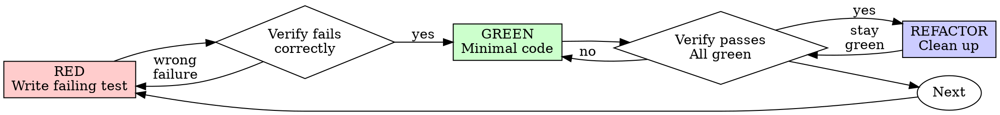

# 08 test-driven-development

## 速查卡 (Quick Reference)

| 维度           | 内容 |
|----------------|------|
| 触发时机       | 实现任何功能、修复 bug、重构代码——在写一行 production 代码之前 |
| 调用链上游     | executing-plans（任务实现阶段），subagent-driven-development（implementer subagent 遵循本 skill） |
| 调用链下游     | verification-before-completion（TDD 完成后进行完成验证） |
| 核心产出       | 每个功能/bugfix 都有对应的自动化测试，且每个测试在实现之前都曾被观察到 FAIL |
| 关联 Subagents | 无 |

---

## 一、原文

### SKILL.md

```
---
name: test-driven-development
description: Use when implementing any feature or bugfix, before writing implementation code
---

# Test-Driven Development (TDD)

## Overview

Write the test first. Watch it fail. Write minimal code to pass.

**Core principle:** If you didn't watch the test fail, you don't know if it tests the right thing.

**Violating the letter of the rules is violating the spirit of the rules.**

## When to Use

**Always:**
- New features
- Bug fixes
- Refactoring
- Behavior changes

**Exceptions (ask your human partner):**
- Throwaway prototypes
- Generated code
- Configuration files

Thinking "skip TDD just this once"? Stop. That's rationalization.

## The Iron Law

```
NO PRODUCTION CODE WITHOUT A FAILING TEST FIRST
```

Write code before the test? Delete it. Start over.

**No exceptions:**
- Don't keep it as "reference"
- Don't "adapt" it while writing tests
- Don't look at it
- Delete means delete

Implement fresh from tests. Period.

## Red-Green-Refactor



### RED - Write Failing Test

Write one minimal test showing what should happen.

<Good>
```typescript
test('retries failed operations 3 times', async () => {
  let attempts = 0;
  const operation = () => {
    attempts++;
    if (attempts < 3) throw new Error('fail');
    return 'success';
  };

  const result = await retryOperation(operation);

  expect(result).toBe('success');
  expect(attempts).toBe(3);
});
```
Clear name, tests real behavior, one thing
</Good>

<Bad>
```typescript
test('retry works', async () => {
  const mock = jest.fn()
    .mockRejectedValueOnce(new Error())
    .mockRejectedValueOnce(new Error())
    .mockResolvedValueOnce('success');
  await retryOperation(mock);
  expect(mock).toHaveBeenCalledTimes(3);
});
```
Vague name, tests mock not code
</Bad>

**Requirements:**
- One behavior
- Clear name
- Real code (no mocks unless unavoidable)

### Verify RED - Watch It Fail

**MANDATORY. Never skip.**

```bash
npm test path/to/test.test.ts
```

Confirm:
- Test fails (not errors)
- Failure message is expected
- Fails because feature missing (not typos)

**Test passes?** You're testing existing behavior. Fix test.

**Test errors?** Fix error, re-run until it fails correctly.

### GREEN - Minimal Code

Write simplest code to pass the test.

<Good>
```typescript
async function retryOperation<T>(fn: () => Promise<T>): Promise<T> {
  for (let i = 0; i < 3; i++) {
    try {
      return await fn();
    } catch (e) {
      if (i === 2) throw e;
    }
  }
  throw new Error('unreachable');
}
```
Just enough to pass
</Good>

<Bad>
```typescript
async function retryOperation<T>(
  fn: () => Promise<T>,
  options?: {
    maxRetries?: number;
    backoff?: 'linear' | 'exponential';
    onRetry?: (attempt: number) => void;
  }
): Promise<T> {
  // YAGNI
}
```
Over-engineered
</Bad>

Don't add features, refactor other code, or "improve" beyond the test.

### Verify GREEN - Watch It Pass

**MANDATORY.**

```bash
npm test path/to/test.test.ts
```

Confirm:
- Test passes
- Other tests still pass
- Output pristine (no errors, warnings)

**Test fails?** Fix code, not test.

**Other tests fail?** Fix now.

### REFACTOR - Clean Up

After green only:
- Remove duplication
- Improve names
- Extract helpers

Keep tests green. Don't add behavior.

### Repeat

Next failing test for next feature.

## Good Tests

| Quality | Good | Bad |
|---------|------|-----|
| **Minimal** | One thing. "and" in name? Split it. | `test('validates email and domain and whitespace')` |
| **Clear** | Name describes behavior | `test('test1')` |
| **Shows intent** | Demonstrates desired API | Obscures what code should do |

## Why Order Matters

**"I'll write tests after to verify it works"**

Tests written after code pass immediately. Passing immediately proves nothing:
- Might test wrong thing
- Might test implementation, not behavior
- Might miss edge cases you forgot
- You never saw it catch the bug

Test-first forces you to see the test fail, proving it actually tests something.

**"I already manually tested all the edge cases"**

Manual testing is ad-hoc. You think you tested everything but:
- No record of what you tested
- Can't re-run when code changes
- Easy to forget cases under pressure
- "It worked when I tried it" ≠ comprehensive

Automated tests are systematic. They run the same way every time.

**"Deleting X hours of work is wasteful"**

Sunk cost fallacy. The time is already gone. Your choice now:
- Delete and rewrite with TDD (X more hours, high confidence)
- Keep it and add tests after (30 min, low confidence, likely bugs)

The "waste" is keeping code you can't trust. Working code without real tests is technical debt.

**"TDD is dogmatic, being pragmatic means adapting"**

TDD IS pragmatic:
- Finds bugs before commit (faster than debugging after)
- Prevents regressions (tests catch breaks immediately)
- Documents behavior (tests show how to use code)
- Enables refactoring (change freely, tests catch breaks)

"Pragmatic" shortcuts = debugging in production = slower.

**"Tests after achieve the same goals - it's spirit not ritual"**

No. Tests-after answer "What does this do?" Tests-first answer "What should this do?"

Tests-after are biased by your implementation. You test what you built, not what's required. You verify remembered edge cases, not discovered ones.

Tests-first force edge case discovery before implementing. Tests-after verify you remembered everything (you didn't).

30 minutes of tests after ≠ TDD. You get coverage, lose proof tests work.

## Common Rationalizations

| Excuse | Reality |
|--------|---------|
| "Too simple to test" | Simple code breaks. Test takes 30 seconds. |
| "I'll test after" | Tests passing immediately prove nothing. |
| "Tests after achieve same goals" | Tests-after = "what does this do?" Tests-first = "what should this do?" |
| "Already manually tested" | Ad-hoc ≠ systematic. No record, can't re-run. |
| "Deleting X hours is wasteful" | Sunk cost fallacy. Keeping unverified code is technical debt. |
| "Keep as reference, write tests first" | You'll adapt it. That's testing after. Delete means delete. |
| "Need to explore first" | Fine. Throw away exploration, start with TDD. |
| "Test hard = design unclear" | Listen to test. Hard to test = hard to use. |
| "TDD will slow me down" | TDD faster than debugging. Pragmatic = test-first. |
| "Manual test faster" | Manual doesn't prove edge cases. You'll re-test every change. |
| "Existing code has no tests" | You're improving it. Add tests for existing code. |

## Red Flags - STOP and Start Over

- Code before test
- Test after implementation
- Test passes immediately
- Can't explain why test failed
- Tests added "later"
- Rationalizing "just this once"
- "I already manually tested it"
- "Tests after achieve the same purpose"
- "It's about spirit not ritual"
- "Keep as reference" or "adapt existing code"
- "Already spent X hours, deleting is wasteful"
- "TDD is dogmatic, I'm being pragmatic"
- "This is different because..."

**All of these mean: Delete code. Start over with TDD.**

## Example: Bug Fix

**Bug:** Empty email accepted

**RED**
```typescript
test('rejects empty email', async () => {
  const result = await submitForm({ email: '' });
  expect(result.error).toBe('Email required');
});
```

**Verify RED**
```bash
$ npm test
FAIL: expected 'Email required', got undefined
```

**GREEN**
```typescript
function submitForm(data: FormData) {
  if (!data.email?.trim()) {
    return { error: 'Email required' };
  }
  // ...
}
```

**Verify GREEN**
```bash
$ npm test
PASS
```

**REFACTOR**
Extract validation for multiple fields if needed.

## Verification Checklist

Before marking work complete:

- [ ] Every new function/method has a test
- [ ] Watched each test fail before implementing
- [ ] Each test failed for expected reason (feature missing, not typo)
- [ ] Wrote minimal code to pass each test
- [ ] All tests pass
- [ ] Output pristine (no errors, warnings)
- [ ] Tests use real code (mocks only if unavoidable)
- [ ] Edge cases and errors covered

Can't check all boxes? You skipped TDD. Start over.

## When Stuck

| Problem | Solution |
|---------|----------|
| Don't know how to test | Write wished-for API. Write assertion first. Ask your human partner. |
| Test too complicated | Design too complicated. Simplify interface. |
| Must mock everything | Code too coupled. Use dependency injection. |
| Test setup huge | Extract helpers. Still complex? Simplify design. |

## Debugging Integration

Bug found? Write failing test reproducing it. Follow TDD cycle. Test proves fix and prevents regression.

Never fix bugs without a test.

## Testing Anti-Patterns

When adding mocks or test utilities, read @testing-anti-patterns.md to avoid common pitfalls:
- Testing mock behavior instead of real behavior
- Adding test-only methods to production classes
- Mocking without understanding dependencies

## Final Rule

```
Production code → test exists and failed first
Otherwise → not TDD
```

No exceptions without your human partner's permission.
```

---

### testing-anti-patterns.md

```
# Testing Anti-Patterns

**Load this reference when:** writing or changing tests, adding mocks, or tempted to add test-only methods to production code.

## Overview

Tests must verify real behavior, not mock behavior. Mocks are a means to isolate, not the thing being tested.

**Core principle:** Test what the code does, not what the mocks do.

**Following strict TDD prevents these anti-patterns.**

## The Iron Laws

```
1. NEVER test mock behavior
2. NEVER add test-only methods to production classes
3. NEVER mock without understanding dependencies
```

## Anti-Pattern 1: Testing Mock Behavior

**The violation:**
```typescript
// ❌ BAD: Testing that the mock exists
test('renders sidebar', () => {
  render(<Page />);
  expect(screen.getByTestId('sidebar-mock')).toBeInTheDocument();
});
```

**Why this is wrong:**
- You're verifying the mock works, not that the component works
- Test passes when mock is present, fails when it's not
- Tells you nothing about real behavior

**your human partner's correction:** "Are we testing the behavior of a mock?"

**The fix:**
```typescript
// ✅ GOOD: Test real component or don't mock it
test('renders sidebar', () => {
  render(<Page />);  // Don't mock sidebar
  expect(screen.getByRole('navigation')).toBeInTheDocument();
});

// OR if sidebar must be mocked for isolation:
// Don't assert on the mock - test Page's behavior with sidebar present
```

### Gate Function

```
BEFORE asserting on any mock element:
  Ask: "Am I testing real component behavior or just mock existence?"

  IF testing mock existence:
    STOP - Delete the assertion or unmock the component

  Test real behavior instead
```

## Anti-Pattern 2: Test-Only Methods in Production

**The violation:**
```typescript
// ❌ BAD: destroy() only used in tests
class Session {
  async destroy() {  // Looks like production API!
    await this._workspaceManager?.destroyWorkspace(this.id);
    // ... cleanup
  }
}

// In tests
afterEach(() => session.destroy());
```

**Why this is wrong:**
- Production class polluted with test-only code
- Dangerous if accidentally called in production
- Violates YAGNI and separation of concerns
- Confuses object lifecycle with entity lifecycle

**The fix:**
```typescript
// ✅ GOOD: Test utilities handle test cleanup
// Session has no destroy() - it's stateless in production

// In test-utils/
export async function cleanupSession(session: Session) {
  const workspace = session.getWorkspaceInfo();
  if (workspace) {
    await workspaceManager.destroyWorkspace(workspace.id);
  }
}

// In tests
afterEach(() => cleanupSession(session));
```

### Gate Function

```
BEFORE adding any method to production class:
  Ask: "Is this only used by tests?"

  IF yes:
    STOP - Don't add it
    Put it in test utilities instead

  Ask: "Does this class own this resource's lifecycle?"

  IF no:
    STOP - Wrong class for this method
```

## Anti-Pattern 3: Mocking Without Understanding

**The violation:**
```typescript
// ❌ BAD: Mock breaks test logic
test('detects duplicate server', () => {
  // Mock prevents config write that test depends on!
  vi.mock('ToolCatalog', () => ({
    discoverAndCacheTools: vi.fn().mockResolvedValue(undefined)
  }));

  await addServer(config);
  await addServer(config);  // Should throw - but won't!
});
```

**Why this is wrong:**
- Mocked method had side effect test depended on (writing config)
- Over-mocking to "be safe" breaks actual behavior
- Test passes for wrong reason or fails mysteriously

**The fix:**
```typescript
// ✅ GOOD: Mock at correct level
test('detects duplicate server', () => {
  // Mock the slow part, preserve behavior test needs
  vi.mock('MCPServerManager'); // Just mock slow server startup

  await addServer(config);  // Config written
  await addServer(config);  // Duplicate detected ✓
});
```

### Gate Function

```
BEFORE mocking any method:
  STOP - Don't mock yet

  1. Ask: "What side effects does the real method have?"
  2. Ask: "Does this test depend on any of those side effects?"
  3. Ask: "Do I fully understand what this test needs?"

  IF depends on side effects:
    Mock at lower level (the actual slow/external operation)
    OR use test doubles that preserve necessary behavior
    NOT the high-level method the test depends on

  IF unsure what test depends on:
    Run test with real implementation FIRST
    Observe what actually needs to happen
    THEN add minimal mocking at the right level

  Red flags:
    - "I'll mock this to be safe"
    - "This might be slow, better mock it"
    - Mocking without understanding the dependency chain
```

## Anti-Pattern 4: Incomplete Mocks

**The violation:**
```typescript
// ❌ BAD: Partial mock - only fields you think you need
const mockResponse = {
  status: 'success',
  data: { userId: '123', name: 'Alice' }
  // Missing: metadata that downstream code uses
};

// Later: breaks when code accesses response.metadata.requestId
```

**Why this is wrong:**
- **Partial mocks hide structural assumptions** - You only mocked fields you know about
- **Downstream code may depend on fields you didn't include** - Silent failures
- **Tests pass but integration fails** - Mock incomplete, real API complete
- **False confidence** - Test proves nothing about real behavior

**The Iron Rule:** Mock the COMPLETE data structure as it exists in reality, not just fields your immediate test uses.

**The fix:**
```typescript
// ✅ GOOD: Mirror real API completeness
const mockResponse = {
  status: 'success',
  data: { userId: '123', name: 'Alice' },
  metadata: { requestId: 'req-789', timestamp: 1234567890 }
  // All fields real API returns
};
```

### Gate Function

```
BEFORE creating mock responses:
  Check: "What fields does the real API response contain?"

  Actions:
    1. Examine actual API response from docs/examples
    2. Include ALL fields system might consume downstream
    3. Verify mock matches real response schema completely

  Critical:
    If you're creating a mock, you must understand the ENTIRE structure
    Partial mocks fail silently when code depends on omitted fields

  If uncertain: Include all documented fields
```

## Anti-Pattern 5: Integration Tests as Afterthought

**The violation:**
```
✅ Implementation complete
❌ No tests written
"Ready for testing"
```

**Why this is wrong:**
- Testing is part of implementation, not optional follow-up
- TDD would have caught this
- Can't claim complete without tests

**The fix:**
```
TDD cycle:
1. Write failing test
2. Implement to pass
3. Refactor
4. THEN claim complete
```

## When Mocks Become Too Complex

**Warning signs:**
- Mock setup longer than test logic
- Mocking everything to make test pass
- Mocks missing methods real components have
- Test breaks when mock changes

**your human partner's question:** "Do we need to be using a mock here?"

**Consider:** Integration tests with real components often simpler than complex mocks

## TDD Prevents These Anti-Patterns

**Why TDD helps:**
1. **Write test first** → Forces you to think about what you're actually testing
2. **Watch it fail** → Confirms test tests real behavior, not mocks
3. **Minimal implementation** → No test-only methods creep in
4. **Real dependencies** → You see what the test actually needs before mocking

**If you're testing mock behavior, you violated TDD** - you added mocks without watching test fail against real code first.

## Quick Reference

| Anti-Pattern | Fix |
|--------------|-----|
| Assert on mock elements | Test real component or unmock it |
| Test-only methods in production | Move to test utilities |
| Mock without understanding | Understand dependencies first, mock minimally |
| Incomplete mocks | Mirror real API completely |
| Tests as afterthought | TDD - tests first |
| Over-complex mocks | Consider integration tests |

## Red Flags

- Assertion checks for `*-mock` test IDs
- Methods only called in test files
- Mock setup is >50% of test
- Test fails when you remove mock
- Can't explain why mock is needed
- Mocking "just to be safe"

## The Bottom Line

**Mocks are tools to isolate, not things to test.**

If TDD reveals you're testing mock behavior, you've gone wrong.

Fix: Test real behavior or question why you're mocking at all.
```

---

## 二、中文翻译

### SKILL.md 翻译

**概述**

先写测试。看它失败。写最少的代码让它通过。

**核心原则：** 如果你没有亲眼看到测试失败，你就不知道它是否在测试正确的东西。

**违反规则的字面意义，就是违反规则的精神。**

**何时使用**

**始终适用：**
- 新功能
- Bug 修复
- 重构
- 行为变更

**例外情况（需询问 human partner）：**
- 一次性原型
- 生成代码
- 配置文件

想着"就这一次跳过 TDD"？停下来。那是自我合理化。

**铁律**

```
没有先写失败的测试，就没有 production 代码
```

先写了代码再写测试？删掉它。从头开始。

**无例外：**
- 不要以"参考"为由留着它
- 不要"边写测试边适配"它
- 不要看它
- 删除就是删除

从测试出发重新实现。句号。

**Red-Green-Refactor 循环**（见 3.4 流程图）

**RED——写失败测试**

写一个最小化的测试，描述预期行为。

要求：
- 只测一个行为
- 名称清晰
- 使用真实代码（只有迫不得已才用 mock）

**Verify RED——亲眼看它失败（强制，不可跳过）**

确认：
- 测试失败（不是报错）
- 失败信息符合预期
- 因为功能缺失而失败（不是拼写错误）

测试通过了？说明你在测试已有行为，修改测试。测试报错？修复错误，重新运行直到它正确地失败。

**GREEN——最小实现**

写最简单的代码让测试通过。不要添加功能、重构其他代码或"改进"超出测试需求的部分。

**Verify GREEN——亲眼看它通过（强制）**

确认：
- 测试通过
- 其他测试仍然通过
- 输出干净（无错误、警告）

测试失败？修代码，不是修测试。其他测试失败？立即修复。

**REFACTOR——清理（仅在 green 之后）**

- 去除重复
- 改善命名
- 提取 helper

保持测试通过，不添加行为。

**好测试的标准**

| 质量维度 | 好的做法 | 坏的做法 |
|---------|---------|---------|
| **最小化** | 只测一件事。名称里有"and"？拆开。 | `test('validates email and domain and whitespace')` |
| **清晰** | 名称描述行为 | `test('test1')` |
| **展示意图** | 演示期望的 API | 掩盖代码应该做什么 |

**为什么顺序至关重要**

"事后写测试"的问题：事后写的测试立即通过，而立即通过什么都证明不了——可能测错了东西，可能测实现而非行为，可能遗漏了边界条件，你从未看到它捕获 bug。

"已经手动测过了"的问题：手动测试是临时性的——没有记录、无法重跑、压力下容易遗忘。自动化测试是系统性的，每次以相同方式运行。

"删掉 X 小时的工作太浪费了"：这是沉没成本谬误。时间已经过去了。留着无法信任的代码才是真正的浪费，那叫技术债。

**常见自我合理化**

| 借口 | 现实 |
|------|------|
| "太简单了不用测" | 简单代码也会出 bug，写测试只需 30 秒。 |
| "我事后再测" | 测试立即通过什么都证明不了。 |
| "事后测试能达到同样目的" | 事后测试 = "这是什么？"，先写测试 = "这应该是什么？" |
| "已经手动测过了" | 临时性 ≠ 系统性。没有记录，无法重跑。 |
| "删掉 X 小时很浪费" | 沉没成本谬误。留着无法验证的代码才是技术债。 |
| "先留着参考，再写测试" | 你会去适配它，那就是事后测试。删除就是删除。 |
| "需要先探索一下" | 可以。扔掉探索结果，用 TDD 重新开始。 |
| "测试难写 = 设计不清晰" | 倾听测试的反馈，难以测试 = 难以使用。 |
| "TDD 会让我变慢" | TDD 比调试更快，务实就是先写测试。 |
| "手动测试更快" | 手动测试无法证明边界条件，每次改代码都要重测。 |
| "现有代码没有测试" | 你在改进它，为现有代码补测试。 |

**红旗警示——停下来重新开始**

- 先写代码
- 实现之后才写测试
- 测试立即通过
- 无法解释为何测试失败
- 测试"之后再加"
- 合理化"就这一次"
- "我已经手动测过了"
- "事后测试能达到同样目的"
- "关键是精神不是仪式"
- "留着参考"或"适配现有代码"
- "已经花了 X 小时，删掉太浪费了"
- "TDD 太教条，我在务实"
- "这次情况不同，因为……"

**以上所有情况都意味着：删掉代码，用 TDD 重新开始。**

**当遇到困难时**

| 问题 | 解决方案 |
|------|---------|
| 不知道怎么测 | 写出期望的 API，先写断言，询问 human partner。 |
| 测试太复杂 | 设计太复杂，简化接口。 |
| 必须 mock 所有东西 | 代码耦合太高，使用依赖注入。 |
| 测试 setup 很庞大 | 提取 helper，还是复杂？简化设计。 |

**调试集成**

发现 bug？先写一个重现 bug 的失败测试，再按 TDD 循环走。测试既证明了修复，也防止了回归。永远不要在没有测试的情况下修复 bug。

**最终规则**

```
production 代码 → 必须有先失败过的测试
否则 → 不是 TDD
```

没有 human partner 的许可，无例外。

---

### testing-anti-patterns.md 翻译

**加载时机：** 编写或修改测试时、添加 mock 时、或者有冲动向 production 代码添加仅测试用方法时。

**概述**

测试必须验证真实行为，而不是 mock 的行为。Mock 是隔离的手段，不是被测对象。

**核心原则：** 测试代码做了什么，而不是 mock 做了什么。

**严格遵循 TDD 可以防止这些反模式。**

**铁律**

```
1. 永远不要测试 mock 行为
2. 永远不要向 production 类添加仅测试用方法
3. 永远不要在不理解依赖的情况下使用 mock
```

**反模式 1：测试 Mock 行为**（见 3.3 详解）

**反模式 2：Production 代码中的仅测试方法**（见 3.3 详解）

**反模式 3：不理解依赖就使用 Mock**（见 3.3 详解）

**反模式 4：不完整的 Mock**（见 3.3 详解）

**反模式 5：把集成测试当作事后补充**（见 3.3 详解）

**Mock 变得过于复杂时的警示信号：**
- Mock setup 比测试逻辑还长
- Mock 所有东西才能让测试通过
- Mock 缺少真实组件拥有的方法
- Mock 改变时测试就崩溃

此时应考虑：用真实组件做集成测试往往比复杂的 mock 更简单。

**TDD 如何防止这些反模式：**
1. 先写测试 → 强迫你思考你实际在测什么
2. 看它失败 → 确认测试测的是真实行为，而不是 mock
3. 最小实现 → 仅测试用方法不会悄悄混入
4. 真实依赖 → 在 mock 之前，你会看到测试真正需要什么

**如果你在测试 mock 行为，说明你违反了 TDD**——你在没有看着测试对真实代码失败之前就添加了 mock。

**最终原则**

**Mock 是用来隔离的工具，不是被测对象。**

如果 TDD 揭示你在测试 mock 行为，说明方向错了。修复方法：测试真实行为，或质疑为什么要 mock。

---

## 三、剖析解读

### 3.1 功能与定位

TDD 在 superpowers 体系中是**执行阶段的编码纪律约束层**。它不是一个可选的"最佳实践"，而是实现每个任务时必须遵循的工作方式。

```
superpowers 体系中的位置：

brainstorming → writing-plans → executing-plans
                                      │
                                      ▼
                              [每个实现任务]
                                      │
                                      ▼
                           test-driven-development  ← 本 skill
                                      │
                                      ▼
                      verification-before-completion
```

**核心价值：强迫你在写代码之前明确"什么叫做正确"。**

这是设计层面的约束：在你还不能写 production 代码时，你必须先用一个测试来描述期望行为。这个过程强迫你：

1. 把模糊的需求转化为可执行的断言
2. 在实现之前先设计 API（怎么调用这个函数？）
3. 通过"看到失败"来证明测试确实在检验行为

**"违反字面规则就是违反精神"** 是这个 skill 最强硬的立场。它预见了所有"灵活变通"的借口，并将它们全部拒绝。

### 3.2 使用场景与案例

**标准场景：新功能实现**

假设 executing-plans 中 Task 3 是"实现优惠券折扣计算函数 `calculate_discount(price, coupon)`"。

TDD 流程如下：

```
Step 1: RED — 先写测试

def test_calculate_10pct_discount():
    coupon = Coupon(rate=0.10)
    assert calculate_discount(100, coupon) == 90

Step 2: 运行，确认 FAIL
$ pytest test_discount.py
FAILED: NameError: name 'calculate_discount' is not defined
(因为函数不存在，符合预期)

Step 3: GREEN — 写最小实现

def calculate_discount(price: float, coupon: Coupon) -> float:
    return price * (1 - coupon.rate)

Step 4: 运行，确认 PASS
$ pytest test_discount.py
PASSED

Step 5: commit

Step 6: 写下一个测试——边界条件
def test_discount_with_zero_price():
    coupon = Coupon(rate=0.10)
    assert calculate_discount(0, coupon) == 0

def test_expired_coupon_raises():
    expired = Coupon(rate=0.10, expires="2020-01-01")
    with pytest.raises(CouponExpiredError):
        calculate_discount(100, expired)

(重复循环)
```

**Bug 修复场景**

SKILL.md 中的示例：表单接受空 email。

```
RED:  test('rejects empty email') → FAIL (expected 'Email required', got undefined)
GREEN: 添加 if (!data.email?.trim()) 验证 → PASS
意义: 这个测试证明了 bug 真实存在，也证明了修复确实生效
```

**区别于"事后补测试"的关键点**

| 维度 | TDD（先写测试） | 事后测试 |
|------|----------------|---------|
| 问题 | "这应该做什么？" | "这做了什么？" |
| 视角 | 用户/调用者视角 | 实现者视角 |
| 边界条件 | 在实现前发现 | 基于记忆，容易遗漏 |
| 测试有效性 | 经过失败验证 | 无法证明测试有效 |
| 设计反馈 | 测试难写 = 接口难用 | 设计问题被遮蔽 |

### 3.3 Subagents / References 深度解读

本 skill 引用了 `@testing-anti-patterns.md`，以下逐条解读其 5 个反模式：

**反模式 1：Testing Mock Behavior（测试 Mock 行为）**

| 维度 | 内容 |
|------|------|
| 是什么 | 断言检查的是 mock 元素是否存在（如 `getByTestId('sidebar-mock')`），而不是真实组件行为 |
| 为什么有害 | 测试通过只说明 mock 存在，不说明组件正确工作；测试与真实行为脱节 |
| 正确做法 | 断言真实组件行为（如 `getByRole('navigation')`），或不 mock 该组件 |
| 与 TDD 的关系 | 严格 TDD 可以防止此问题：先写失败测试时，你会对真实组件写断言；若对 mock 写断言，测试在 mock 加入之前就通过了，矛盾暴露 |

**反模式 2：Test-Only Methods in Production（Production 代码污染）**

| 维度 | 内容 |
|------|------|
| 是什么 | 向 production 类添加只在测试中使用的方法（如 `Session.destroy()`） |
| 为什么有害 | 污染 production API、可能在生产环境被意外调用、违反 YAGNI 和关注点分离 |
| 正确做法 | 将测试清理逻辑放在 `test-utils/` 目录下的独立函数中 |
| 判断门槛 | "这个方法只被测试文件调用吗？" → 是 → 不要加，放到 test utilities |

**反模式 3：Mocking Without Understanding（不理解就 Mock）**

| 维度 | 内容 |
|------|------|
| 是什么 | Mock 了一个方法，但没有意识到测试依赖该方法的副作用（如写配置文件）；"保险起见"过度 mock |
| 为什么有害 | Mock 切断了测试依赖的副作用链，导致测试通过原因错误，或测试神秘失败 |
| 正确做法 | Mock 之前先用真实实现运行测试，观察实际需要什么，然后在正确的层级（最底层的慢/外部操作）添加最小 mock |
| 红旗信号 | "我 mock 这个是为了安全起见"、"这个可能很慢，最好 mock 掉" |

**反模式 4：Incomplete Mocks（不完整的 Mock）**

| 维度 | 内容 |
|------|------|
| 是什么 | Mock response 只包含当前测试直接用到的字段，遗漏了下游代码依赖的字段 |
| 为什么有害 | 测试通过但集成失败，产生虚假的安全感；`response.metadata.requestId` 访问时静默崩溃 |
| 正确做法 | Mock 必须镜像真实 API 的完整数据结构，包括所有系统可能在下游消费的字段 |
| 铁律 | "如果你在创建 mock，你必须理解整个数据结构" |

**反模式 5：Integration Tests as Afterthought（测试作为事后补充）**

| 维度 | 内容 |
|------|------|
| 是什么 | 实现完成后才写测试，或把"去测试"当作实现完成后的独立步骤 |
| 为什么有害 | 测试是实现的一部分，不是可选的后续步骤；违反 TDD 的根本原则 |
| 正确做法 | TDD 循环本身就包含测试，没有先写测试就没有"实现完成" |

**5个反模式的共同根源总结：**

```
所有反模式都源于同一个错误：
把测试当成"验证实现"的工具，而不是"定义行为"的工具。

TDD 通过强制"先写测试并看到失败"来从根本上消除这种误解。
```

### 3.4 流程图 / 示意图

**Red-Green-Refactor 循环**

```
       ┌─────────────────────────────────────┐
       │                                     │
       ▼                                     │
  写失败测试 (Red)                           │
  - 一个行为                                 │
  - 清晰的名称                               │
  - 使用真实代码                             │
       │                                     │
       ▼                                     │
  运行 → 确认 FAIL  ─── 测试报错? ──► 修复错误重跑
  (强制，不可跳过)   \                       │
                      测试通过? ──► 修改测试 │
       │                                     │
       ▼                                     │
  写最小实现 (Green)                         │
  - 只让测试通过                             │
  - 不过度设计 (YAGNI)                       │
       │                                     │
       ▼                                     │
  运行 → 确认 PASS  ─── 仍然失败? ──► 修代码(不改测试)
  (强制)             \                       │
                      其他测试失败? ──► 立即修复
       │                                     │
       ▼                                     │
  重构优化 (Refactor)                        │
  - 去除重复                                 │
  - 改善命名                                 │
  - 提取 helper                              │
  - 保持测试通过                             │
       │                                     │
       ▼                                     │
    commit ──────────────────────────────────┘
       │
       ▼ (有更多行为需要测试?)
  下一个失败测试
```

**TDD 与 Mock 使用决策树**

```
需要隔离某个依赖?
       │
       ▼
我是否理解该依赖的所有副作用?
       │
  ┌────┴────┐
  否        是
  │         │
  ▼         ▼
先用真实    这个测试依赖那些副作用吗?
实现运行         │
  │         ┌────┴────┐
  │         是        否
  │         │         │
  │         ▼         ▼
  └────► 在更底层   在此处 mock
         处 mock    (最小范围)
              │         │
              └────┬────┘
                   ▼
           mock 是完整的吗?
           (所有下游字段都包含?)
                   │
              ┌────┴────┐
              否        是
              │         │
              ▼         ▼
           补完整     继续
```

### 3.5 与其他 Skills 的协作关系

| 协作 Skill | 关系类型 | 说明 |
|------------|----------|------|
| executing-plans | 上游调用方 | executing-plans 中每个任务的实现阶段必须遵循 TDD；TDD 是 executing-plans 内嵌的编码纪律 |
| subagent-driven-development | 上游调用方 | implementer subagents 在执行具体实现任务时遵循本 skill；TDD 是 subagent 编写代码的操作规范 |
| verification-before-completion | 下游接收方 | TDD 完成后（所有测试 PASS，checklist 全勾），才进入 verification-before-completion 阶段做最终验证 |
| systematic-debugging | 配对使用 | 当 TDD 循环中测试失败且原因不明时，切换到 systematic-debugging 诊断根因；bug 定位后回到 TDD 写失败测试再修复 |
| brainstorming / writing-plans | 间接上游 | brainstorming 和 writing-plans 产出的设计规格定义了"要实现什么"；TDD 将这些规格转化为可执行的测试断言，是设计到代码的桥梁 |
